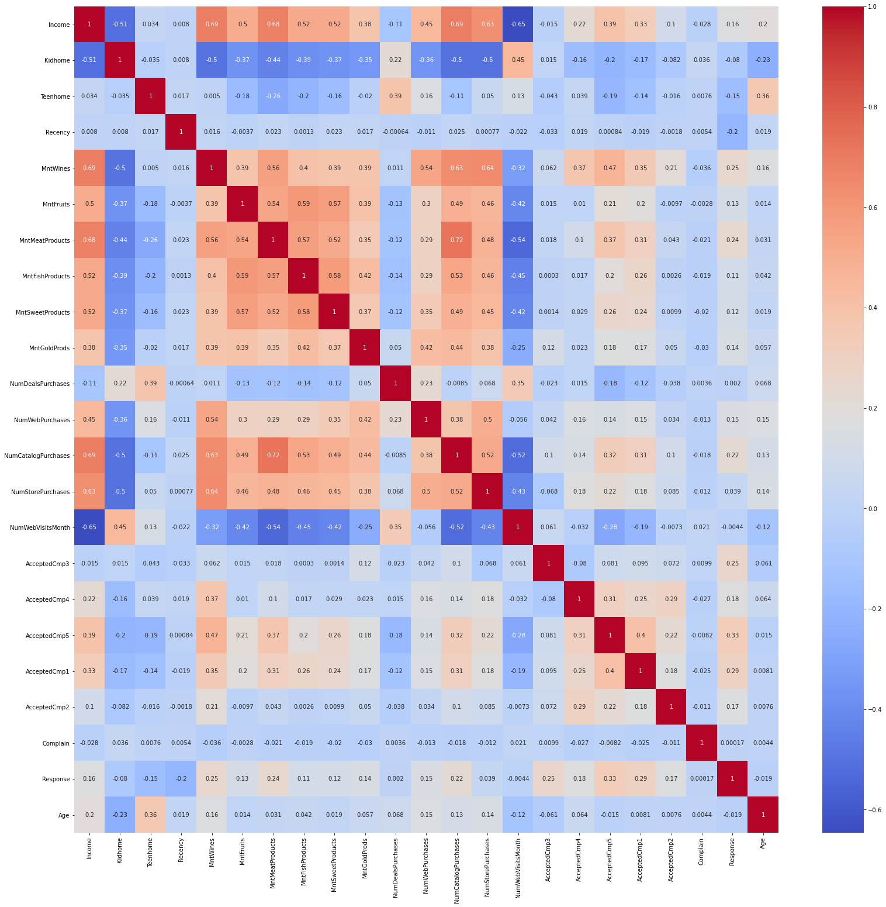
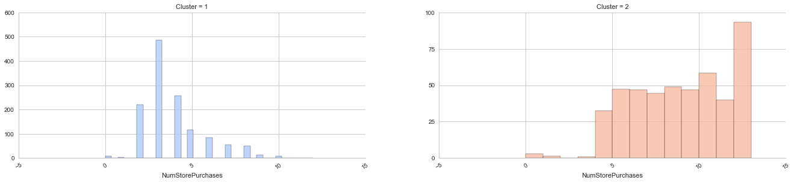

# Data-Mining-Lab
Course Code: CS626

Course Supervisor: Dr. Tahseen Ahmed jilani

_Department of Computer Science_

_University of Karachi_

### Data Source:
You can find the data source on [Kaggle.com](https://www.kaggle.com/imakash3011/customer-personality-analysis?select=marketing_campaign.csv)

### Project Details:
Project details and description will be found in the documentation present in this repository


# Experiment

**Objectives:**

1. Predict the customer's response to marketting offers.
2. Perform Clustering Techniques to categorize the customer base.

------------------

#### Contents:

1. __Data OverView & Preprocessing__
    - [Checking for Null Values](#Checking-for-Null-Values)
    - [Checking Duplicate Values](#Checking-Duplicate-Values)
    - [Looking at Uniques values](#Looking-at-Uniques-values)
    - [Some More Tweaking](#Some-More-Tweaking)
    - [Checking for Outliers](#Checking-for-Outliers)
    - [Final Pre-Processsed Dataset](#Final-Pre-Processsed-Dataset)
2. __Exploratory Data Analysis__
    - [Univariate Analysis](#Univariate-Analysis)
    - [Bivariate Analysis](#Bivariate-Analysis)
    - [Multivariate Analysis](#Multivariate-Analysis)
3. __Feature Selection & Dimensionality Reduction__
    - [Preparing Sample for Prediction Models](#Preparing-Sample-for-Prediction-Models)
    - [Feature Selection by Random Forest](#Feature-Selection-by-Random-Forest)
    - [PCA Transformation](#PCA-Transformation)
4. __Supervised Predictions__
    - [Preparing Data For Classification Models](#Preparing-Data-For-Classification-Models)
    - [Logistic Regression](#Logistic-Regression)
    - [Boosting Tree](#Boosting-Tree)
    - [SVM](#SVM)
    - [Neural Networks](#Neural-Networks)
    - [Performance Comparison Among All 4 Models](#Performance-Comparison-Among-All-4-Models)
    - [Final Model Performance](#Final-Model-Performance)
5. __Un-Supervised Predictions__
    - [Feature Engineering and Clustering](#Feature-Engineering-and-Clustering)
    - [K-Means](#K-Means)
    - [Gaussian Mixture Model](#Gaussian-Mixture-Model)
6. __Summary__
    - [1_ Customer-Related Summary](#1_-Customer-Related-Summary)
    - [2_ Supervised Prediction Summary](#2_-Supervised-Prediction-Summary)
    - [3_ Unsupervised Prediction Summary](#3_-Unsupervised-Prediction-Summary)

----


```python
#importing required modules

import pandas as pd
import numpy as np
import matplotlib.pyplot as plt
import matplotlib.dates as mdates
import seaborn as sns
import scipy
from scipy.stats.mstats import winsorize
import random
import math
from tqdm import tqdm

from sklearn import preprocessing
from sklearn.metrics import matthews_corrcoef
from sklearn.metrics import accuracy_score
from sklearn.metrics import confusion_matrix
from sklearn.metrics import classification_report
from sklearn.model_selection import train_test_split
from sklearn.ensemble import RandomForestClassifier
from sklearn.tree import DecisionTreeClassifier
from sklearn.model_selection import cross_val_score
from sklearn.model_selection import KFold
from sklearn.linear_model import LogisticRegression
from sklearn.kernel_ridge import KernelRidge
from sklearn.ensemble import AdaBoostClassifier
from sklearn.metrics import fbeta_score, make_scorer
from sklearn import svm

import plotly.graph_objects as go
import plotly.express as px
import plotly.figure_factory as ff
%matplotlib inline
```

## 1. Data OverView & Preprocessing


```python
# Had to use '\t' separator, since all the rows were merged into one column cell.
Sample = pd.read_csv('marketing_campaign.csv',sep='\t')
Sample.head()
```


<div>

<table border="1" class="dataframe">
  <thead>
    <tr style="text-align: right;">
      <th></th>
      <th>ID</th>
      <th>Year_Birth</th>
      <th>Education</th>
      <th>Marital_Status</th>
      <th>Income</th>
      <th>Kidhome</th>
      <th>Teenhome</th>
      <th>Dt_Customer</th>
      <th>Recency</th>
      <th>MntWines</th>
      <th>...</th>
      <th>NumWebVisitsMonth</th>
      <th>AcceptedCmp3</th>
      <th>AcceptedCmp4</th>
      <th>AcceptedCmp5</th>
      <th>AcceptedCmp1</th>
      <th>AcceptedCmp2</th>
      <th>Complain</th>
      <th>Z_CostContact</th>
      <th>Z_Revenue</th>
      <th>Response</th>
    </tr>
  </thead>
  <tbody>
    <tr>
      <th>0</th>
      <td>5524</td>
      <td>1957</td>
      <td>Graduation</td>
      <td>Single</td>
      <td>58138.0</td>
      <td>0</td>
      <td>0</td>
      <td>04-09-2012</td>
      <td>58</td>
      <td>635</td>
      <td>...</td>
      <td>7</td>
      <td>0</td>
      <td>0</td>
      <td>0</td>
      <td>0</td>
      <td>0</td>
      <td>0</td>
      <td>3</td>
      <td>11</td>
      <td>1</td>
    </tr>
    <tr>
      <th>1</th>
      <td>2174</td>
      <td>1954</td>
      <td>Graduation</td>
      <td>Single</td>
      <td>46344.0</td>
      <td>1</td>
      <td>1</td>
      <td>08-03-2014</td>
      <td>38</td>
      <td>11</td>
      <td>...</td>
      <td>5</td>
      <td>0</td>
      <td>0</td>
      <td>0</td>
      <td>0</td>
      <td>0</td>
      <td>0</td>
      <td>3</td>
      <td>11</td>
      <td>0</td>
    </tr>
    <tr>
      <th>2</th>
      <td>4141</td>
      <td>1965</td>
      <td>Graduation</td>
      <td>Together</td>
      <td>71613.0</td>
      <td>0</td>
      <td>0</td>
      <td>21-08-2013</td>
      <td>26</td>
      <td>426</td>
      <td>...</td>
      <td>4</td>
      <td>0</td>
      <td>0</td>
      <td>0</td>
      <td>0</td>
      <td>0</td>
      <td>0</td>
      <td>3</td>
      <td>11</td>
      <td>0</td>
    </tr>
    <tr>
      <th>3</th>
      <td>6182</td>
      <td>1984</td>
      <td>Graduation</td>
      <td>Together</td>
      <td>26646.0</td>
      <td>1</td>
      <td>0</td>
      <td>10-02-2014</td>
      <td>26</td>
      <td>11</td>
      <td>...</td>
      <td>6</td>
      <td>0</td>
      <td>0</td>
      <td>0</td>
      <td>0</td>
      <td>0</td>
      <td>0</td>
      <td>3</td>
      <td>11</td>
      <td>0</td>
    </tr>
    <tr>
      <th>4</th>
      <td>5324</td>
      <td>1981</td>
      <td>PhD</td>
      <td>Married</td>
      <td>58293.0</td>
      <td>1</td>
      <td>0</td>
      <td>19-01-2014</td>
      <td>94</td>
      <td>173</td>
      <td>...</td>
      <td>5</td>
      <td>0</td>
      <td>0</td>
      <td>0</td>
      <td>0</td>
      <td>0</td>
      <td>0</td>
      <td>3</td>
      <td>11</td>
      <td>0</td>
    </tr>
  </tbody>
</table>
<p>5 rows × 29 columns</p>
</div>


```python
# Listing the columns' names
Sample.info()
```

    <class 'pandas.core.frame.DataFrame'>
    RangeIndex: 2240 entries, 0 to 2239
    Data columns (total 29 columns):
     #   Column               Non-Null Count  Dtype  
    ---  ------               --------------  -----  
     0   ID                   2240 non-null   int64  
     1   Year_Birth           2240 non-null   int64  
     2   Education            2240 non-null   object 
     3   Marital_Status       2240 non-null   object 
     4   Income               2216 non-null   float64
     5   Kidhome              2240 non-null   int64  
     6   Teenhome             2240 non-null   int64  
     7   Dt_Customer          2240 non-null   object 
     8   Recency              2240 non-null   int64  
     9   MntWines             2240 non-null   int64  
     10  MntFruits            2240 non-null   int64  
     11  MntMeatProducts      2240 non-null   int64  
     12  MntFishProducts      2240 non-null   int64  
     13  MntSweetProducts     2240 non-null   int64  
     14  MntGoldProds         2240 non-null   int64  
     15  NumDealsPurchases    2240 non-null   int64  
     16  NumWebPurchases      2240 non-null   int64  
     17  NumCatalogPurchases  2240 non-null   int64  
     18  NumStorePurchases    2240 non-null   int64  
     19  NumWebVisitsMonth    2240 non-null   int64  
     20  AcceptedCmp3         2240 non-null   int64  
     21  AcceptedCmp4         2240 non-null   int64  
     22  AcceptedCmp5         2240 non-null   int64  
     23  AcceptedCmp1         2240 non-null   int64  
     24  AcceptedCmp2         2240 non-null   int64  
     25  Complain             2240 non-null   int64  
     26  Z_CostContact        2240 non-null   int64  
     27  Z_Revenue            2240 non-null   int64  
     28  Response             2240 non-null   int64  
    dtypes: float64(1), int64(25), object(3)
    memory usage: 507.6+ KB
    

**COMMENT:** *we mostly have integer data types. Discrete methods might become necessary.*

### Checking for Null Values


```python
# Checking for Null Values
Sample.isna().sum()
```


    ID                      0
    Year_Birth              0
    Education               0
    Marital_Status          0
    Income                 24
    Kidhome                 0
    Teenhome                0
    Dt_Customer             0
    Recency                 0
    MntWines                0
    MntFruits               0
    MntMeatProducts         0
    MntFishProducts         0
    MntSweetProducts        0
    MntGoldProds            0
    NumDealsPurchases       0
    NumWebPurchases         0
    NumCatalogPurchases     0
    NumStorePurchases       0
    NumWebVisitsMonth       0
    AcceptedCmp3            0
    AcceptedCmp4            0
    AcceptedCmp5            0
    AcceptedCmp1            0
    AcceptedCmp2            0
    Complain                0
    Z_CostContact           0
    Z_Revenue               0
    Response                0
    dtype: int64


**COMMENT:** *Filling up the Null values with average (generic normalization method). Only Income column was affected, therefore we mostly have original data.*


```python
Sample['Income'].fillna(np.mean(Sample['Income']), inplace=True)

# converting currency type for better evaluation.
Sample['Income'] = Sample['Income'] / 1000

# Just for confirmation of Null value removal
for i in Sample.isna().sum():
    if i != 0:
        print(i)
else:
    print("Filling Null spaces Successful!")
```

    Filling Null spaces Successful!
    

### Checking Duplicate Values


```python
Sample.duplicated().sum()
```


    0


**COMMENT:** *No duplicates were found*

### Looking at Uniques values


```python
pd.DataFrame(Sample.nunique()).sort_values(0).rename( {0: 'Unique Values'}, axis=1)
```


<div>
<style scoped>
    .dataframe tbody tr th:only-of-type {
        vertical-align: middle;
    }

    .dataframe tbody tr th {
        vertical-align: top;
    }

    .dataframe thead th {
        text-align: right;
    }
</style>
<table border="1" class="dataframe">
  <thead>
    <tr style="text-align: right;">
      <th></th>
      <th>Unique Values</th>
    </tr>
  </thead>
  <tbody>
    <tr>
      <th>Z_Revenue</th>
      <td>1</td>
    </tr>
    <tr>
      <th>Z_CostContact</th>
      <td>1</td>
    </tr>
    <tr>
      <th>Response</th>
      <td>2</td>
    </tr>
    <tr>
      <th>AcceptedCmp3</th>
      <td>2</td>
    </tr>
    <tr>
      <th>AcceptedCmp4</th>
      <td>2</td>
    </tr>
    <tr>
      <th>AcceptedCmp2</th>
      <td>2</td>
    </tr>
    <tr>
      <th>Complain</th>
      <td>2</td>
    </tr>
    <tr>
      <th>AcceptedCmp1</th>
      <td>2</td>
    </tr>
    <tr>
      <th>AcceptedCmp5</th>
      <td>2</td>
    </tr>
    <tr>
      <th>Kidhome</th>
      <td>3</td>
    </tr>
    <tr>
      <th>Teenhome</th>
      <td>3</td>
    </tr>
    <tr>
      <th>Education</th>
      <td>5</td>
    </tr>
    <tr>
      <th>Marital_Status</th>
      <td>8</td>
    </tr>
    <tr>
      <th>NumCatalogPurchases</th>
      <td>14</td>
    </tr>
    <tr>
      <th>NumStorePurchases</th>
      <td>14</td>
    </tr>
    <tr>
      <th>NumDealsPurchases</th>
      <td>15</td>
    </tr>
    <tr>
      <th>NumWebPurchases</th>
      <td>15</td>
    </tr>
    <tr>
      <th>NumWebVisitsMonth</th>
      <td>16</td>
    </tr>
    <tr>
      <th>Year_Birth</th>
      <td>59</td>
    </tr>
    <tr>
      <th>Recency</th>
      <td>100</td>
    </tr>
    <tr>
      <th>MntFruits</th>
      <td>158</td>
    </tr>
    <tr>
      <th>MntSweetProducts</th>
      <td>177</td>
    </tr>
    <tr>
      <th>MntFishProducts</th>
      <td>182</td>
    </tr>
    <tr>
      <th>MntGoldProds</th>
      <td>213</td>
    </tr>
    <tr>
      <th>MntMeatProducts</th>
      <td>558</td>
    </tr>
    <tr>
      <th>Dt_Customer</th>
      <td>663</td>
    </tr>
    <tr>
      <th>MntWines</th>
      <td>776</td>
    </tr>
    <tr>
      <th>Income</th>
      <td>1975</td>
    </tr>
    <tr>
      <th>ID</th>
      <td>2240</td>
    </tr>
  </tbody>
</table>
</div>


**COMMENT:** 
- *Z_Revenue and Z_CostContact have only single values for all entries, therefore we will remove those columns*
- *Other entries are good to go. Except for ID and Dt_Customer, they won't be necessary in our analysis*


```python
# Dropping the "Z_Revenue" and "Z_CostContact" columns
Sample.drop(['Z_CostContact', 'Z_Revenue'], axis=1, inplace=True)

# Also dropping "ID" and "Dt_Customer", since they are not useful in our processing.
Sample.drop(['ID', 'Dt_Customer'], axis=1, inplace=True) 
```

### Some More Tweaking


```python
# Converting "Year_Birth" to "Age"
Sample['Age'] = 2021 - Sample.Year_Birth.to_numpy()
Sample.drop('Year_Birth', axis=1, inplace=True)
```


```python
Sample['Marital_Status'].value_counts()
```


    Married     864
    Together    580
    Single      480
    Divorced    232
    Widow        77
    Alone         3
    YOLO          2
    Absurd        2
    Name: Marital_Status, dtype: int64


**COMMENT:** *This categorization is not good, since many factors suggest that **Alone, YOLO, Absurd** should be regrouped into **Single***


```python
# Re-grouping "Marital_Status" Column
Sample['Marital_Status'] = Sample['Marital_Status'].replace(['Alone','YOLO','Absurd'],'Single')
```


```python
Sample['Education'].value_counts()
```


    Graduation    1127
    PhD            486
    Master         370
    2n Cycle       203
    Basic           54
    Name: Education, dtype: int64


**COMMENT:** *This categorization shows too many unnecessary groups. For example, **2n-Cycle** is equivalent to **Masters***


```python
Sample['Education'].replace(['2n Cycle', 'Graduation'], ['Master', 'Bachelor'], inplace=True)
```

### Checking for Outliers


```python
# using box plot to visualize outliers in numerial fields of the dataset

n = Sample.select_dtypes(include=np.number).columns.tolist()
bins=10
j=1
fig = plt.figure(figsize = (20, 30))
for i in n:
    plt.subplot(7,4,j)
    plt.boxplot(Sample[i])
    j=j+1
    plt.xlabel(i)
plt.show()
```


    

    


**COMMENT:** *Since we are sure about outliers in "Age" and "Income" pose unnecessary plots, therefore we can remove them. As for other fields, we are not sure, therefore we wil let them be.*


```python
Sample.drop(Sample[(Sample['Income']>200)|(Sample['Age']>100)].index,inplace=True)
```

### Final Pre-Processsed Dataset


```python
Sample.head()
```


<div>
<style scoped>
    .dataframe tbody tr th:only-of-type {
        vertical-align: middle;
    }

    .dataframe tbody tr th {
        vertical-align: top;
    }

    .dataframe thead th {
        text-align: right;
    }
</style>
<table border="1" class="dataframe">
  <thead>
    <tr style="text-align: right;">
      <th></th>
      <th>Education</th>
      <th>Marital_Status</th>
      <th>Income</th>
      <th>Kidhome</th>
      <th>Teenhome</th>
      <th>Recency</th>
      <th>MntWines</th>
      <th>MntFruits</th>
      <th>MntMeatProducts</th>
      <th>MntFishProducts</th>
      <th>...</th>
      <th>NumStorePurchases</th>
      <th>NumWebVisitsMonth</th>
      <th>AcceptedCmp3</th>
      <th>AcceptedCmp4</th>
      <th>AcceptedCmp5</th>
      <th>AcceptedCmp1</th>
      <th>AcceptedCmp2</th>
      <th>Complain</th>
      <th>Response</th>
      <th>Age</th>
    </tr>
  </thead>
  <tbody>
    <tr>
      <th>0</th>
      <td>Bachelor</td>
      <td>Single</td>
      <td>58.138</td>
      <td>0</td>
      <td>0</td>
      <td>58</td>
      <td>635</td>
      <td>88</td>
      <td>546</td>
      <td>172</td>
      <td>...</td>
      <td>4</td>
      <td>7</td>
      <td>0</td>
      <td>0</td>
      <td>0</td>
      <td>0</td>
      <td>0</td>
      <td>0</td>
      <td>1</td>
      <td>64</td>
    </tr>
    <tr>
      <th>1</th>
      <td>Bachelor</td>
      <td>Single</td>
      <td>46.344</td>
      <td>1</td>
      <td>1</td>
      <td>38</td>
      <td>11</td>
      <td>1</td>
      <td>6</td>
      <td>2</td>
      <td>...</td>
      <td>2</td>
      <td>5</td>
      <td>0</td>
      <td>0</td>
      <td>0</td>
      <td>0</td>
      <td>0</td>
      <td>0</td>
      <td>0</td>
      <td>67</td>
    </tr>
    <tr>
      <th>2</th>
      <td>Bachelor</td>
      <td>Together</td>
      <td>71.613</td>
      <td>0</td>
      <td>0</td>
      <td>26</td>
      <td>426</td>
      <td>49</td>
      <td>127</td>
      <td>111</td>
      <td>...</td>
      <td>10</td>
      <td>4</td>
      <td>0</td>
      <td>0</td>
      <td>0</td>
      <td>0</td>
      <td>0</td>
      <td>0</td>
      <td>0</td>
      <td>56</td>
    </tr>
    <tr>
      <th>3</th>
      <td>Bachelor</td>
      <td>Together</td>
      <td>26.646</td>
      <td>1</td>
      <td>0</td>
      <td>26</td>
      <td>11</td>
      <td>4</td>
      <td>20</td>
      <td>10</td>
      <td>...</td>
      <td>4</td>
      <td>6</td>
      <td>0</td>
      <td>0</td>
      <td>0</td>
      <td>0</td>
      <td>0</td>
      <td>0</td>
      <td>0</td>
      <td>37</td>
    </tr>
    <tr>
      <th>4</th>
      <td>PhD</td>
      <td>Married</td>
      <td>58.293</td>
      <td>1</td>
      <td>0</td>
      <td>94</td>
      <td>173</td>
      <td>43</td>
      <td>118</td>
      <td>46</td>
      <td>...</td>
      <td>6</td>
      <td>5</td>
      <td>0</td>
      <td>0</td>
      <td>0</td>
      <td>0</td>
      <td>0</td>
      <td>0</td>
      <td>0</td>
      <td>40</td>
    </tr>
  </tbody>
</table>
<p>5 rows × 25 columns</p>
</div>


-----

## 2. Exploratory Data Analysis

### Univariate Analysis

We are mainly looking at each variable separately in order to derive insights from it. 


```python
# Marital Status and Education Levels in a pie chart
c_count = Sample.groupby("Marital_Status").count()['Age']
label = Sample.groupby('Marital_Status').count()['Age'].index
fig, ax = plt.subplots(1, 2, figsize = (10, 12))
ax[0].pie(c_count, labels=label, colors=sns.color_palette('pastel')[0:5], autopct='%1.2f%%',radius=2,explode=[0.07,0.07,0.07,0.07,0.07])
ax[0].set_title('Maritial Status', y=-0.6)

c_count = Sample.groupby("Education").count()['Age']
label = Sample.groupby('Education').count()['Age'].index
ax[1].pie(c_count, labels=label, colors=sns.color_palette('pastel')[0:5], autopct='%1.2f%%',radius=2,explode=[0.07,0.07,0.07,0.07])
ax[1].set_title('Education Level', y=-0.6)
plt.subplots_adjust(wspace = 1.5, hspace =0)
plt.show()
```


    

    


**COMMENT:** *We have more Married Couples or Bachelors Degree holders as our customers. Approx. 39% and 50% respectively.*


```python
# Age
plt.figure(figsize=(20, 6))
plt.title('Age distribution')
ax = sns.histplot(Sample['Age'].sort_values(), bins=56, color='skyblue')
sns.rugplot(data=Sample['Age'], height=.05)
plt.xticks(np.linspace(Sample['Age'].min(), Sample['Age'].max(), 56, dtype=int, endpoint = True))
plt.show()
```


    

    


**COMMENT:** *Most of our customers are people among the age of 45-60 years*


```python
# Home with kids and Home with Teens
plt.figure(figsize=(15,5))
plt.subplot(121)
sns.histplot(data=Sample, x='Kidhome', stat="count", discrete=True)
plt.xticks([0, 1, 2])

plt.subplot(122)
sns.histplot(data=Sample, x='Teenhome', stat="count",discrete=True)
plt.xticks([0, 1, 2])
plt.show()

```


    

    


**COMMENT:** *A very small group of people have about either 2 kids or 2 Teens in their home. Other types of customers are significantly large.*


```python
# Response dist. and Income Range
plt.figure(figsize=(15,5))

plt.subplot(121)
sns.histplot(data=Sample, x='Response', stat="count", discrete=True)
plt.xticks([0, 1])

plt.subplot(122)
# Income Range
sns.kdeplot(data=Sample, x="Income", shade=True, log_scale=True)
plt.show()
```


    

    


**COMMENT:** 
    
   - *This shows a very bad situation. The last campaign was **mostly rejected***
    
   - *Income of most people range from 10,000 to 100,000 units*
   
-----

### Bivariate Analysis

Here we are performing a comparative analysis of how the variables relate together to each other


```python
# Let's see if "Education" level have any impact on the "Responses" we got.
plt.figure(figsize=(15,5))
plt.subplot(121)
sns.histplot(data=Sample, x="Education", hue="Response", multiple="stack", stat="count",color='skyblue')

# Now we will look for relations among "Marital Status" and "Responses"
plt.subplot(122)
sns.histplot(data=Sample, x="Marital_Status", hue="Response",stat="count", multiple="stack", color='skyblue')
plt.show()
```


    

    


**COMMENT:** 
- *Left figure; people having low education levels were not in the least interested in this campaign.*
- *Right figure; Single people were more likely to accept our offers*


```python
# Let's see if "Homw with kids" level have any impact on the "Responses" we got.
plt.figure(figsize=(15,5))
plt.subplot(121)
sns.histplot(data=Sample, x="Kidhome", hue="Response", multiple="stack", stat="count", discrete=True)
plt.xticks([0, 1, 2])

# Now we will look for relations among "Home with teens" and "Responses"
plt.subplot(122)
sns.histplot(data=Sample, x="Teenhome", hue="Response", multiple="stack", stat="count", discrete=True)
plt.xticks([0, 1, 2])
plt.show()
```


    

    


**COMMENT:** *People with no kids or teens at home were more interested in our campaign*


```python
# Let's see if "Income" has any impact on the "Responses", "Marital Status", "Education", "Kid Home".
plt.figure(figsize=(15,10))
plt.subplot(221)
sns.kdeplot(
   data=Sample, x="Income", hue="Response", log_scale= True,
   fill=True, common_norm=False,
   alpha=.5, linewidth=0,
)
plt.gca().axes.get_yaxis().set_visible(False) # Set y invisible
plt.xlabel('Income')

# segment by Marital_Status
plt.subplot(222)
sns.kdeplot(
   data=Sample, x="Income", hue="Marital_Status", log_scale= True,
   fill=True, common_norm=False, palette="crest",
   alpha=.5, linewidth=0,
)
plt.gca().axes.get_yaxis().set_visible(False) 

# segment by Education
plt.subplot(223)
sns.kdeplot(
   data=Sample, x="Income", hue="Education", log_scale= True,
   fill=True, common_norm=False, palette="crest",
   alpha=.5, linewidth=0,
)
plt.gca().axes.get_yaxis().set_visible(False) 

# segment by Kidhome
plt.subplot(224)
sns.kdeplot(
   data=Sample, x="Income", hue="Kidhome", log_scale= True,
   fill=True, common_norm=False, palette="crest",
   alpha=.5, linewidth=0,
)
plt.gca().axes.get_yaxis().set_visible(False)
```


    

    


**COMMENT:**
    
   - *People with more Income are more likely to accept our offers. We can say that people with income 14-15,000 or less don't seem that much interested.* 
   - *Different Marital Status does not seem to be the cause of positive or negative response to our marketing campaign.*
   - *People having lower level of education have less income. Those Bachelors, Masters or Ph.D degrees do not have clear difference between their incomes.*
   - *Those who do not have kids at home have higher income.*

----

### Multivariate Analysis

Here we are going to compare multiple variables to see if they any relations.


```python
# Re-stating variable types
pd.DataFrame(Sample.nunique()).sort_values(0).rename( {0: 'Unique Values'}, axis=1)
```


<div>
<style scoped>
    .dataframe tbody tr th:only-of-type {
        vertical-align: middle;
    }

    .dataframe tbody tr th {
        vertical-align: top;
    }

    .dataframe thead th {
        text-align: right;
    }
</style>
<table border="1" class="dataframe">
  <thead>
    <tr style="text-align: right;">
      <th></th>
      <th>Unique Values</th>
    </tr>
  </thead>
  <tbody>
    <tr>
      <th>Complain</th>
      <td>2</td>
    </tr>
    <tr>
      <th>AcceptedCmp2</th>
      <td>2</td>
    </tr>
    <tr>
      <th>AcceptedCmp1</th>
      <td>2</td>
    </tr>
    <tr>
      <th>AcceptedCmp5</th>
      <td>2</td>
    </tr>
    <tr>
      <th>AcceptedCmp4</th>
      <td>2</td>
    </tr>
    <tr>
      <th>AcceptedCmp3</th>
      <td>2</td>
    </tr>
    <tr>
      <th>Response</th>
      <td>2</td>
    </tr>
    <tr>
      <th>Kidhome</th>
      <td>3</td>
    </tr>
    <tr>
      <th>Teenhome</th>
      <td>3</td>
    </tr>
    <tr>
      <th>Education</th>
      <td>4</td>
    </tr>
    <tr>
      <th>Marital_Status</th>
      <td>5</td>
    </tr>
    <tr>
      <th>NumStorePurchases</th>
      <td>14</td>
    </tr>
    <tr>
      <th>NumCatalogPurchases</th>
      <td>14</td>
    </tr>
    <tr>
      <th>NumDealsPurchases</th>
      <td>15</td>
    </tr>
    <tr>
      <th>NumWebPurchases</th>
      <td>15</td>
    </tr>
    <tr>
      <th>NumWebVisitsMonth</th>
      <td>16</td>
    </tr>
    <tr>
      <th>Age</th>
      <td>56</td>
    </tr>
    <tr>
      <th>Recency</th>
      <td>100</td>
    </tr>
    <tr>
      <th>MntFruits</th>
      <td>158</td>
    </tr>
    <tr>
      <th>MntSweetProducts</th>
      <td>177</td>
    </tr>
    <tr>
      <th>MntFishProducts</th>
      <td>182</td>
    </tr>
    <tr>
      <th>MntGoldProds</th>
      <td>213</td>
    </tr>
    <tr>
      <th>MntMeatProducts</th>
      <td>557</td>
    </tr>
    <tr>
      <th>MntWines</th>
      <td>775</td>
    </tr>
    <tr>
      <th>Income</th>
      <td>1971</td>
    </tr>
  </tbody>
</table>
</div>


```python
# looking for linear trends between numerical values
NUMERICAL_FEATURES = ['Age', 'Recency', 'MntFruits', 
                      'MntSweetProducts', 'MntFishProducts', 'MntGoldProds', 
                      'MntMeatProducts', 'MntWines', 'Income']

sns.pairplot(data=Sample[NUMERICAL_FEATURES], 
             kind='scatter', plot_kws={'alpha':0.4})
plt.show()
```


    

    


```python
# Heat map among all numerical variables
cor = Sample.corr()
plt.figure(figsize = (27,26))
sns.heatmap(cor, annot = True, cmap = 'coolwarm')
plt.show()
```


    

    


**COMMENT:** *We found no linear relationships between the numerical variables*

----
----

## 3. Feature Selection & Dimensionality Reduction

### Preparing Sample for Prediction Models


```python
# Converting Education with scale numerals
df_cluster = Sample.copy() # saving for clustering 

Sample['Education'] = Sample['Education'].replace(['Basic'], 0)
Sample['Education'] = Sample['Education'].replace(['Bachelor'], 1)
Sample['Education'] = Sample['Education'].replace(['Master'], 2)
Sample['Education'] = Sample['Education'].replace(['PhD'], 3) 

# Change Marital_Status to dummies
Sample = pd.get_dummies(Sample)
Sample.info()
```

    <class 'pandas.core.frame.DataFrame'>
    Int64Index: 2236 entries, 0 to 2239
    Data columns (total 29 columns):
     #   Column                   Non-Null Count  Dtype  
    ---  ------                   --------------  -----  
     0   Education                2236 non-null   int64  
     1   Income                   2236 non-null   float64
     2   Kidhome                  2236 non-null   int64  
     3   Teenhome                 2236 non-null   int64  
     4   Recency                  2236 non-null   int64  
     5   MntWines                 2236 non-null   int64  
     6   MntFruits                2236 non-null   int64  
     7   MntMeatProducts          2236 non-null   int64  
     8   MntFishProducts          2236 non-null   int64  
     9   MntSweetProducts         2236 non-null   int64  
     10  MntGoldProds             2236 non-null   int64  
     11  NumDealsPurchases        2236 non-null   int64  
     12  NumWebPurchases          2236 non-null   int64  
     13  NumCatalogPurchases      2236 non-null   int64  
     14  NumStorePurchases        2236 non-null   int64  
     15  NumWebVisitsMonth        2236 non-null   int64  
     16  AcceptedCmp3             2236 non-null   int64  
     17  AcceptedCmp4             2236 non-null   int64  
     18  AcceptedCmp5             2236 non-null   int64  
     19  AcceptedCmp1             2236 non-null   int64  
     20  AcceptedCmp2             2236 non-null   int64  
     21  Complain                 2236 non-null   int64  
     22  Response                 2236 non-null   int64  
     23  Age                      2236 non-null   int64  
     24  Marital_Status_Divorced  2236 non-null   uint8  
     25  Marital_Status_Married   2236 non-null   uint8  
     26  Marital_Status_Single    2236 non-null   uint8  
     27  Marital_Status_Together  2236 non-null   uint8  
     28  Marital_Status_Widow     2236 non-null   uint8  
    dtypes: float64(1), int64(23), uint8(5)
    memory usage: 447.6 KB
    

---

### Feature Selection by Random Forest


```python
# Using Random Forest to gain an insight on Feature Importance
clf = RandomForestClassifier()
clf.fit(Sample.drop('Response', axis=1), Sample['Response'])

plt.style.use('seaborn-whitegrid')
importance = clf.feature_importances_
importance = pd.DataFrame(importance, index=Sample.drop('Response', axis=1).columns, columns=["Importance"])
importance.sort_values(by='Importance', ascending=True).plot(kind='barh', figsize=(20,len(importance)/2));
```


    

    


```python
# Choosing Features (Keep 90% Importance ratio)
feature_nums = 18
ascend_import = importance.sort_values(by='Importance', ascending=False)
all_info = ascend_import['Importance'].iloc[:feature_nums].sum()
all_choose_features = list(ascend_import.iloc[:feature_nums].index)

for i in range(len(all_choose_features)):
    if i%2==0:
        print(all_choose_features[i]+'   ;   ', end="")
    else:
        print(all_choose_features[i])

print('\n\nImportance Raio: ', all_info)
```

    Recency   ;   MntWines
    Income   ;   MntMeatProducts
    MntGoldProds   ;   Age
    AcceptedCmp3   ;   MntSweetProducts
    AcceptedCmp5   ;   MntFruits
    MntFishProducts   ;   NumWebVisitsMonth
    NumStorePurchases   ;   NumCatalogPurchases
    NumWebPurchases   ;   NumDealsPurchases
    AcceptedCmp1   ;   Education
    
    
    Importance Raio:  0.9097738142686715
    

---

### PCA Transformation


```python
from sklearn.decomposition import PCA
# Calculating PCA for both datasets, and graphing the Variance for each feature, per dataset
std_scale = preprocessing.StandardScaler().fit(Sample.drop('Response', axis=1))
X = std_scale.transform(Sample.drop('Response', axis=1))

pca1 = PCA(0.90, whiten=True) # Keep 90% information
fit1 = pca1.fit(X)

# Graphing the variance per feature
plt.style.use('seaborn-whitegrid')
plt.figure(figsize=(25,7)) 
plt.xlabel('PCA Feature')
plt.ylabel('Variance')
plt.title('PCA for Whole Dataset')
plt.bar(range(0, fit1.explained_variance_ratio_.size), fit1.explained_variance_ratio_);

# Get pca transformed data
pca_data = pca1.transform(X)
pca_data = np.array(pca_data)
print('PCA data shape: ', pca_data.shape)
```

    PCA data shape:  (2236, 19)
    


    

    


```python
# Stores performances of models
perf_df_lst = [None, None, None] 
```


```python
# Data sourse encoding
# 0 --> Raw Data
# 1 --> Selected Features
# 2 --> PCA

# Choose dataset
dataset_num = 1

# 0: Raw Data; 1: Feature Selection Data; 2: PCA Data
all_datasets = [Sample.drop('Response', axis=1).values, Sample[all_choose_features].values, pca_data]

# Choose data
final_data = all_datasets[dataset_num]

```

---
---

## 4. Supervised Predictions

### Preparing Data For Classification Models


```python
# Split the dataset
from imblearn.over_sampling import SMOTE
from collections import  Counter

x_train = final_data[:2000]
y_train = Sample['Response'].values[:2000]
x_test = final_data[2000:]
y_test = Sample['Response'].values[2000:]

print('Train: ', len(x_train))
print('Test: ',  len(x_test))
print('N/P Sample: ', Counter(y_train))

# SMOTE Samples
sm = SMOTE(random_state=2)
x_train, y_train = sm.fit_resample(x_train, y_train.ravel())

print('Train: ', len(x_train))
print('Test: ',  len(x_test))
print('N/P Sample: ', Counter(y_train))

# MCC scorer function
mcc_scorer = make_scorer(matthews_corrcoef)
```

    Train:  2000
    Test:  236
    N/P Sample:  Counter({0: 1698, 1: 302})
    Train:  3396
    Test:  236
    N/P Sample:  Counter({1: 1698, 0: 1698})
    

---

### Logistic Regression


```python
LR = LogisticRegression()

# K-Fold Validation
kfold = 8

# ACC Score
LR_cv_results_acc = cross_val_score(LR, x_train, y_train, cv=kfold, scoring='accuracy')   
msg = "%s k-fold ACC: %f (%f)" % ('LR', LR_cv_results_acc.mean(), LR_cv_results_acc.std())
print(msg)

# MCC Score
LR_cv_results_mcc = cross_val_score(LR, x_train, y_train, cv=kfold, scoring=mcc_scorer)   
msg = "%s k-fold MCC: %f (%f)" % ('LR', LR_cv_results_mcc.mean(), LR_cv_results_mcc.std())
print(msg)
```

    C:\Users\D4Rk_C4K3\anaconda3\lib\site-packages\sklearn\linear_model\_logistic.py:763: ConvergenceWarning: lbfgs failed to converge (status=1):
    STOP: TOTAL NO. of ITERATIONS REACHED LIMIT.
    
    Increase the number of iterations (max_iter) or scale the data as shown in:
        https://scikit-learn.org/stable/modules/preprocessing.html
    Please also refer to the documentation for alternative solver options:
        https://scikit-learn.org/stable/modules/linear_model.html#logistic-regression
      n_iter_i = _check_optimize_result(
    C:\Users\D4Rk_C4K3\anaconda3\lib\site-packages\sklearn\linear_model\_logistic.py:763: ConvergenceWarning: lbfgs failed to converge (status=1):
    STOP: TOTAL NO. of ITERATIONS REACHED LIMIT.
    
    Increase the number of iterations (max_iter) or scale the data as shown in:
        https://scikit-learn.org/stable/modules/preprocessing.html
    Please also refer to the documentation for alternative solver options:
        https://scikit-learn.org/stable/modules/linear_model.html#logistic-regression
      n_iter_i = _check_optimize_result(
    C:\Users\D4Rk_C4K3\anaconda3\lib\site-packages\sklearn\linear_model\_logistic.py:763: ConvergenceWarning: lbfgs failed to converge (status=1):
    STOP: TOTAL NO. of ITERATIONS REACHED LIMIT.
    
    Increase the number of iterations (max_iter) or scale the data as shown in:
        https://scikit-learn.org/stable/modules/preprocessing.html
    Please also refer to the documentation for alternative solver options:
        https://scikit-learn.org/stable/modules/linear_model.html#logistic-regression
      n_iter_i = _check_optimize_result(
    C:\Users\D4Rk_C4K3\anaconda3\lib\site-packages\sklearn\linear_model\_logistic.py:763: ConvergenceWarning: lbfgs failed to converge (status=1):
    STOP: TOTAL NO. of ITERATIONS REACHED LIMIT.
    
    Increase the number of iterations (max_iter) or scale the data as shown in:
        https://scikit-learn.org/stable/modules/preprocessing.html
    Please also refer to the documentation for alternative solver options:
        https://scikit-learn.org/stable/modules/linear_model.html#logistic-regression
      n_iter_i = _check_optimize_result(
    C:\Users\D4Rk_C4K3\anaconda3\lib\site-packages\sklearn\linear_model\_logistic.py:763: ConvergenceWarning: lbfgs failed to converge (status=1):
    STOP: TOTAL NO. of ITERATIONS REACHED LIMIT.
    
    Increase the number of iterations (max_iter) or scale the data as shown in:
        https://scikit-learn.org/stable/modules/preprocessing.html
    Please also refer to the documentation for alternative solver options:
        https://scikit-learn.org/stable/modules/linear_model.html#logistic-regression
      n_iter_i = _check_optimize_result(
    C:\Users\D4Rk_C4K3\anaconda3\lib\site-packages\sklearn\linear_model\_logistic.py:763: ConvergenceWarning: lbfgs failed to converge (status=1):
    STOP: TOTAL NO. of ITERATIONS REACHED LIMIT.
    
    Increase the number of iterations (max_iter) or scale the data as shown in:
        https://scikit-learn.org/stable/modules/preprocessing.html
    Please also refer to the documentation for alternative solver options:
        https://scikit-learn.org/stable/modules/linear_model.html#logistic-regression
      n_iter_i = _check_optimize_result(
    C:\Users\D4Rk_C4K3\anaconda3\lib\site-packages\sklearn\linear_model\_logistic.py:763: ConvergenceWarning: lbfgs failed to converge (status=1):
    STOP: TOTAL NO. of ITERATIONS REACHED LIMIT.
    
    Increase the number of iterations (max_iter) or scale the data as shown in:
        https://scikit-learn.org/stable/modules/preprocessing.html
    Please also refer to the documentation for alternative solver options:
        https://scikit-learn.org/stable/modules/linear_model.html#logistic-regression
      n_iter_i = _check_optimize_result(
    C:\Users\D4Rk_C4K3\anaconda3\lib\site-packages\sklearn\linear_model\_logistic.py:763: ConvergenceWarning: lbfgs failed to converge (status=1):
    STOP: TOTAL NO. of ITERATIONS REACHED LIMIT.
    
    Increase the number of iterations (max_iter) or scale the data as shown in:
        https://scikit-learn.org/stable/modules/preprocessing.html
    Please also refer to the documentation for alternative solver options:
        https://scikit-learn.org/stable/modules/linear_model.html#logistic-regression
      n_iter_i = _check_optimize_result(
    C:\Users\D4Rk_C4K3\anaconda3\lib\site-packages\sklearn\linear_model\_logistic.py:763: ConvergenceWarning: lbfgs failed to converge (status=1):
    STOP: TOTAL NO. of ITERATIONS REACHED LIMIT.
    
    Increase the number of iterations (max_iter) or scale the data as shown in:
        https://scikit-learn.org/stable/modules/preprocessing.html
    Please also refer to the documentation for alternative solver options:
        https://scikit-learn.org/stable/modules/linear_model.html#logistic-regression
      n_iter_i = _check_optimize_result(
    C:\Users\D4Rk_C4K3\anaconda3\lib\site-packages\sklearn\linear_model\_logistic.py:763: ConvergenceWarning: lbfgs failed to converge (status=1):
    STOP: TOTAL NO. of ITERATIONS REACHED LIMIT.
    
    Increase the number of iterations (max_iter) or scale the data as shown in:
        https://scikit-learn.org/stable/modules/preprocessing.html
    Please also refer to the documentation for alternative solver options:
        https://scikit-learn.org/stable/modules/linear_model.html#logistic-regression
      n_iter_i = _check_optimize_result(
    

    LR k-fold ACC: 0.750893 (0.017630)
    

    C:\Users\D4Rk_C4K3\anaconda3\lib\site-packages\sklearn\linear_model\_logistic.py:763: ConvergenceWarning: lbfgs failed to converge (status=1):
    STOP: TOTAL NO. of ITERATIONS REACHED LIMIT.
    
    Increase the number of iterations (max_iter) or scale the data as shown in:
        https://scikit-learn.org/stable/modules/preprocessing.html
    Please also refer to the documentation for alternative solver options:
        https://scikit-learn.org/stable/modules/linear_model.html#logistic-regression
      n_iter_i = _check_optimize_result(
    C:\Users\D4Rk_C4K3\anaconda3\lib\site-packages\sklearn\linear_model\_logistic.py:763: ConvergenceWarning: lbfgs failed to converge (status=1):
    STOP: TOTAL NO. of ITERATIONS REACHED LIMIT.
    
    Increase the number of iterations (max_iter) or scale the data as shown in:
        https://scikit-learn.org/stable/modules/preprocessing.html
    Please also refer to the documentation for alternative solver options:
        https://scikit-learn.org/stable/modules/linear_model.html#logistic-regression
      n_iter_i = _check_optimize_result(
    C:\Users\D4Rk_C4K3\anaconda3\lib\site-packages\sklearn\linear_model\_logistic.py:763: ConvergenceWarning: lbfgs failed to converge (status=1):
    STOP: TOTAL NO. of ITERATIONS REACHED LIMIT.
    
    Increase the number of iterations (max_iter) or scale the data as shown in:
        https://scikit-learn.org/stable/modules/preprocessing.html
    Please also refer to the documentation for alternative solver options:
        https://scikit-learn.org/stable/modules/linear_model.html#logistic-regression
      n_iter_i = _check_optimize_result(
    C:\Users\D4Rk_C4K3\anaconda3\lib\site-packages\sklearn\linear_model\_logistic.py:763: ConvergenceWarning: lbfgs failed to converge (status=1):
    STOP: TOTAL NO. of ITERATIONS REACHED LIMIT.
    
    Increase the number of iterations (max_iter) or scale the data as shown in:
        https://scikit-learn.org/stable/modules/preprocessing.html
    Please also refer to the documentation for alternative solver options:
        https://scikit-learn.org/stable/modules/linear_model.html#logistic-regression
      n_iter_i = _check_optimize_result(
    

    LR k-fold MCC: 0.502319 (0.035211)
    

    C:\Users\D4Rk_C4K3\anaconda3\lib\site-packages\sklearn\linear_model\_logistic.py:763: ConvergenceWarning: lbfgs failed to converge (status=1):
    STOP: TOTAL NO. of ITERATIONS REACHED LIMIT.
    
    Increase the number of iterations (max_iter) or scale the data as shown in:
        https://scikit-learn.org/stable/modules/preprocessing.html
    Please also refer to the documentation for alternative solver options:
        https://scikit-learn.org/stable/modules/linear_model.html#logistic-regression
      n_iter_i = _check_optimize_result(
    C:\Users\D4Rk_C4K3\anaconda3\lib\site-packages\sklearn\linear_model\_logistic.py:763: ConvergenceWarning: lbfgs failed to converge (status=1):
    STOP: TOTAL NO. of ITERATIONS REACHED LIMIT.
    
    Increase the number of iterations (max_iter) or scale the data as shown in:
        https://scikit-learn.org/stable/modules/preprocessing.html
    Please also refer to the documentation for alternative solver options:
        https://scikit-learn.org/stable/modules/linear_model.html#logistic-regression
      n_iter_i = _check_optimize_result(
    

<p><b>OUTPUT>></b>LR k-fold ACC: 0.749420 (0.015291)</p>
<p><b>OUTPUT>></b>LR k-fold MCC: 0.499386 (0.030593)</p>

---

### Boosting Tree


```python
# Validation for Boosting Tree
clf = AdaBoostClassifier(base_estimator=DecisionTreeClassifier(max_depth=2), n_estimators=160, random_state=1)  
# ACC Score
BT_cv_results_acc = cross_val_score(clf, x_train, y_train, cv=kfold, scoring='accuracy')   
msg = "k-fold ACC: %f (%f)" % (BT_cv_results_acc.mean(), BT_cv_results_acc.std())
print(msg)

# MCC Score
BT_cv_results_mcc = cross_val_score(clf, x_train, y_train, cv=kfold, scoring=mcc_scorer)   
msg = "k-fold MCC: %f (%f)" % (BT_cv_results_mcc.mean(), BT_cv_results_mcc.std())
print(msg)
```

    k-fold ACC: 0.903476 (0.098889)
    k-fold MCC: 0.819825 (0.173745)
    

---

### SVM


```python
SVM=svm.SVC(kernel = 'rbf', C = 10, gamma = 0.01)

# ACC Score
svm_cv_results_acc = cross_val_score(SVM, x_train, y_train, cv=kfold, scoring='accuracy')   
msg = "k-fold ACC: %f (%f)" % (svm_cv_results_acc.mean(), svm_cv_results_acc.std())
print(msg)

# MCC Score
svm_cv_results_mcc = cross_val_score(SVM, x_train, y_train, cv=kfold, scoring=mcc_scorer)   
msg = "k-fold MCC: %f (%f)" % (svm_cv_results_mcc.mean(), svm_cv_results_mcc.std())
print(msg)
```

    k-fold ACC: 0.802105 (0.023620)
    k-fold MCC: 0.644576 (0.039894)
    

---

### Neural Networks


```python
# import modules
from keras import models
from keras import layers

x_nn = x_train
y_nn = y_train
```


```python
# Define the K-fold Cross Validator
kfold_obj = KFold(n_splits=kfold, shuffle=True)
epochs = 150
batch_size = 64
acc_per_fold = []
mcc_per_fold = []

# K-fold Cross Validation model evaluation
fold_no = 1
for train, test in kfold_obj.split(x_nn, y_nn):
    
    model = models.Sequential()
    # Only use shallow Neural Network
    model.add(layers.Dense(32, activation='relu'))
    model.add(layers.Dense(1, activation='sigmoid'))
    model.compile(optimizer='rmsprop', loss='binary_crossentropy', metrics=['accuracy'])

    # Generate a print
    print('------------------------------------------------------------------------')
    print(f'Training for fold {fold_no} ...')
    
    # Fit data to model
    history = model.fit(x_nn[train], y_nn[train].reshape(-1, 1),
              batch_size=64,
              epochs=100)

    # Generate generalization metrics
    predictions = model.predict(x_nn[test])
    
    for i in range(len(predictions)):
        if predictions[i] >=0.5:
            predictions[i] = 1
        else:
            predictions[i] = 0
            
    acc_per_fold.append(accuracy_score(predictions, y_nn[test]))
    mcc_per_fold.append(matthews_corrcoef(predictions, y_nn[test]))

    # Increase fold number
    fold_no = fold_no + 1

```

    ------------------------------------------------------------------------
    Training for fold 1 ...
    Epoch 1/100
    47/47 [==============================] - 1s 1ms/step - loss: 14.7443 - accuracy: 0.5150
    Epoch 2/100
    47/47 [==============================] - 0s 1ms/step - loss: 5.0344 - accuracy: 0.5914
    Epoch 3/100
    47/47 [==============================] - 0s 1ms/step - loss: 3.0739 - accuracy: 0.6473
    Epoch 4/100
    47/47 [==============================] - 0s 1ms/step - loss: 2.2507 - accuracy: 0.6695
    Epoch 5/100
    47/47 [==============================] - 0s 1ms/step - loss: 1.8620 - accuracy: 0.6846
    Epoch 6/100
    47/47 [==============================] - 0s 1ms/step - loss: 1.5295 - accuracy: 0.6974
    Epoch 7/100
    47/47 [==============================] - 0s 2ms/step - loss: 1.5116 - accuracy: 0.6860
    Epoch 8/100
    47/47 [==============================] - 0s 1ms/step - loss: 1.3697 - accuracy: 0.7031
    Epoch 9/100
    47/47 [==============================] - 0s 1ms/step - loss: 1.2780 - accuracy: 0.7072
    Epoch 10/100
    47/47 [==============================] - 0s 1ms/step - loss: 1.2435 - accuracy: 0.7196
    Epoch 11/100
    47/47 [==============================] - 0s 1ms/step - loss: 1.1951 - accuracy: 0.7183
    Epoch 12/100
    47/47 [==============================] - 0s 1ms/step - loss: 1.1365 - accuracy: 0.7264
    Epoch 13/100
    47/47 [==============================] - 0s 1ms/step - loss: 1.1171 - accuracy: 0.7210
    Epoch 14/100
    47/47 [==============================] - 0s 1ms/step - loss: 1.1885 - accuracy: 0.7280
    Epoch 15/100
    47/47 [==============================] - 0s 1ms/step - loss: 1.1463 - accuracy: 0.7189
    Epoch 16/100
    47/47 [==============================] - 0s 1ms/step - loss: 1.0773 - accuracy: 0.7304
    Epoch 17/100
    47/47 [==============================] - 0s 1ms/step - loss: 0.9812 - accuracy: 0.7408
    Epoch 18/100
    47/47 [==============================] - 0s 999us/step - loss: 1.0379 - accuracy: 0.7341
    Epoch 19/100
    47/47 [==============================] - 0s 1ms/step - loss: 0.9865 - accuracy: 0.7513
    Epoch 20/100
    47/47 [==============================] - 0s 978us/step - loss: 0.9898 - accuracy: 0.7368
    Epoch 21/100
    47/47 [==============================] - 0s 1ms/step - loss: 0.9581 - accuracy: 0.7489
    Epoch 22/100
    47/47 [==============================] - 0s 1ms/step - loss: 0.9547 - accuracy: 0.7492
    Epoch 23/100
    47/47 [==============================] - 0s 1ms/step - loss: 0.9477 - accuracy: 0.7573
    Epoch 24/100
    47/47 [==============================] - 0s 1ms/step - loss: 0.9834 - accuracy: 0.7391
    Epoch 25/100
    47/47 [==============================] - 0s 1ms/step - loss: 0.9715 - accuracy: 0.7472
    Epoch 26/100
    47/47 [==============================] - 0s 1ms/step - loss: 0.9398 - accuracy: 0.7452
    Epoch 27/100
    47/47 [==============================] - 0s 1ms/step - loss: 0.8465 - accuracy: 0.7610
    Epoch 28/100
    47/47 [==============================] - 0s 1ms/step - loss: 0.9573 - accuracy: 0.7381
    Epoch 29/100
    47/47 [==============================] - 0s 1ms/step - loss: 0.8786 - accuracy: 0.7694
    Epoch 30/100
    47/47 [==============================] - 0s 1ms/step - loss: 0.8935 - accuracy: 0.7540
    Epoch 31/100
    47/47 [==============================] - 0s 1ms/step - loss: 0.8247 - accuracy: 0.7711
    Epoch 32/100
    47/47 [==============================] - 0s 1ms/step - loss: 0.8897 - accuracy: 0.7580
    Epoch 33/100
    47/47 [==============================] - 0s 978us/step - loss: 0.8743 - accuracy: 0.7556
    Epoch 34/100
    47/47 [==============================] - 0s 1ms/step - loss: 0.8854 - accuracy: 0.7529
    Epoch 35/100
    47/47 [==============================] - 0s 1ms/step - loss: 0.8520 - accuracy: 0.7684
    Epoch 36/100
    47/47 [==============================] - 0s 1ms/step - loss: 0.8483 - accuracy: 0.7604
    Epoch 37/100
    47/47 [==============================] - 0s 1ms/step - loss: 0.8179 - accuracy: 0.7765
    Epoch 38/100
    47/47 [==============================] - 0s 1ms/step - loss: 0.8731 - accuracy: 0.7688
    Epoch 39/100
    47/47 [==============================] - 0s 1ms/step - loss: 0.7984 - accuracy: 0.7698
    Epoch 40/100
    47/47 [==============================] - 0s 1ms/step - loss: 0.8754 - accuracy: 0.7614
    Epoch 41/100
    47/47 [==============================] - 0s 1ms/step - loss: 0.7177 - accuracy: 0.7876
    Epoch 42/100
    47/47 [==============================] - 0s 1ms/step - loss: 0.8563 - accuracy: 0.7600
    Epoch 43/100
    47/47 [==============================] - 0s 999us/step - loss: 0.8097 - accuracy: 0.7708
    Epoch 44/100
    47/47 [==============================] - 0s 1ms/step - loss: 0.7812 - accuracy: 0.7829
    Epoch 45/100
    47/47 [==============================] - 0s 1ms/step - loss: 0.8258 - accuracy: 0.7691
    Epoch 46/100
    47/47 [==============================] - 0s 1ms/step - loss: 0.8157 - accuracy: 0.7772
    Epoch 47/100
    47/47 [==============================] - 0s 1ms/step - loss: 0.7862 - accuracy: 0.7765
    Epoch 48/100
    47/47 [==============================] - 0s 1ms/step - loss: 0.8348 - accuracy: 0.7738
    Epoch 49/100
    47/47 [==============================] - 0s 1ms/step - loss: 0.7472 - accuracy: 0.7826
    Epoch 50/100
    47/47 [==============================] - 0s 1ms/step - loss: 0.7795 - accuracy: 0.7839
    Epoch 51/100
    47/47 [==============================] - 0s 1ms/step - loss: 0.7589 - accuracy: 0.7795
    Epoch 52/100
    47/47 [==============================] - 0s 1ms/step - loss: 0.7744 - accuracy: 0.7799
    Epoch 53/100
    47/47 [==============================] - 0s 1ms/step - loss: 0.7907 - accuracy: 0.7762
    Epoch 54/100
    47/47 [==============================] - 0s 1ms/step - loss: 0.7384 - accuracy: 0.7960
    Epoch 55/100
    47/47 [==============================] - 0s 1ms/step - loss: 0.7836 - accuracy: 0.7859
    Epoch 56/100
    47/47 [==============================] - 0s 1ms/step - loss: 0.7453 - accuracy: 0.7782
    Epoch 57/100
    47/47 [==============================] - 0s 1ms/step - loss: 0.7499 - accuracy: 0.7893
    Epoch 58/100
    47/47 [==============================] - 0s 1ms/step - loss: 0.7824 - accuracy: 0.7856
    Epoch 59/100
    47/47 [==============================] - 0s 1ms/step - loss: 0.7963 - accuracy: 0.7789
    Epoch 60/100
    47/47 [==============================] - 0s 1ms/step - loss: 0.7697 - accuracy: 0.7856
    Epoch 61/100
    47/47 [==============================] - 0s 1ms/step - loss: 0.7260 - accuracy: 0.7896
    Epoch 62/100
    47/47 [==============================] - 0s 1ms/step - loss: 0.7739 - accuracy: 0.7883
    Epoch 63/100
    47/47 [==============================] - 0s 1ms/step - loss: 0.6969 - accuracy: 0.7886
    Epoch 64/100
    47/47 [==============================] - 0s 1ms/step - loss: 0.7688 - accuracy: 0.7805
    Epoch 65/100
    47/47 [==============================] - 0s 1ms/step - loss: 0.7668 - accuracy: 0.7846
    Epoch 66/100
    47/47 [==============================] - 0s 1ms/step - loss: 0.7163 - accuracy: 0.7910
    Epoch 67/100
    47/47 [==============================] - 0s 1ms/step - loss: 0.7695 - accuracy: 0.7822
    Epoch 68/100
    47/47 [==============================] - 0s 1ms/step - loss: 0.7634 - accuracy: 0.7819
    Epoch 69/100
    47/47 [==============================] - 0s 1ms/step - loss: 0.6730 - accuracy: 0.8011
    Epoch 70/100
    47/47 [==============================] - 0s 1ms/step - loss: 0.7333 - accuracy: 0.7923
    Epoch 71/100
    47/47 [==============================] - 0s 2ms/step - loss: 0.7284 - accuracy: 0.7954
    Epoch 72/100
    47/47 [==============================] - 0s 1ms/step - loss: 0.7717 - accuracy: 0.7859
    Epoch 73/100
    47/47 [==============================] - 0s 1ms/step - loss: 0.7246 - accuracy: 0.8004
    Epoch 74/100
    47/47 [==============================] - 0s 2ms/step - loss: 0.7051 - accuracy: 0.8021
    Epoch 75/100
    47/47 [==============================] - 0s 1ms/step - loss: 0.7574 - accuracy: 0.7900
    Epoch 76/100
    47/47 [==============================] - 0s 1ms/step - loss: 0.7083 - accuracy: 0.7991
    Epoch 77/100
    47/47 [==============================] - 0s 1ms/step - loss: 0.7286 - accuracy: 0.8014
    Epoch 78/100
    47/47 [==============================] - 0s 1ms/step - loss: 0.6732 - accuracy: 0.8034
    Epoch 79/100
    47/47 [==============================] - 0s 1ms/step - loss: 0.6969 - accuracy: 0.8075
    Epoch 80/100
    47/47 [==============================] - 0s 2ms/step - loss: 0.7141 - accuracy: 0.7997
    Epoch 81/100
    47/47 [==============================] - 0s 1ms/step - loss: 0.6954 - accuracy: 0.8075
    Epoch 82/100
    47/47 [==============================] - 0s 1ms/step - loss: 0.7570 - accuracy: 0.7923
    Epoch 83/100
    47/47 [==============================] - 0s 1ms/step - loss: 0.6240 - accuracy: 0.8078
    Epoch 84/100
    47/47 [==============================] - 0s 1ms/step - loss: 0.7433 - accuracy: 0.8095
    Epoch 85/100
    47/47 [==============================] - 0s 1ms/step - loss: 0.7100 - accuracy: 0.8021
    Epoch 86/100
    47/47 [==============================] - 0s 1ms/step - loss: 0.6757 - accuracy: 0.8061
    Epoch 87/100
    47/47 [==============================] - 0s 1ms/step - loss: 0.7369 - accuracy: 0.7984
    Epoch 88/100
    47/47 [==============================] - 0s 1ms/step - loss: 0.6973 - accuracy: 0.8018
    Epoch 89/100
    47/47 [==============================] - 0s 1ms/step - loss: 0.6682 - accuracy: 0.8075
    Epoch 90/100
    47/47 [==============================] - 0s 1ms/step - loss: 0.6953 - accuracy: 0.8092
    Epoch 91/100
    47/47 [==============================] - 0s 1ms/step - loss: 0.6747 - accuracy: 0.8129
    Epoch 92/100
    47/47 [==============================] - 0s 1ms/step - loss: 0.6476 - accuracy: 0.8112
    Epoch 93/100
    47/47 [==============================] - 0s 1ms/step - loss: 0.6639 - accuracy: 0.8102
    Epoch 94/100
    47/47 [==============================] - 0s 1ms/step - loss: 0.7606 - accuracy: 0.7883
    Epoch 95/100
    47/47 [==============================] - 0s 1ms/step - loss: 0.6458 - accuracy: 0.8031
    Epoch 96/100
    47/47 [==============================] - 0s 1ms/step - loss: 0.6512 - accuracy: 0.8055
    Epoch 97/100
    47/47 [==============================] - 0s 1ms/step - loss: 0.6951 - accuracy: 0.8125
    Epoch 98/100
    47/47 [==============================] - 0s 1ms/step - loss: 0.6170 - accuracy: 0.8162
    Epoch 99/100
    47/47 [==============================] - 0s 1ms/step - loss: 0.6618 - accuracy: 0.8189
    Epoch 100/100
    47/47 [==============================] - 0s 1ms/step - loss: 0.6749 - accuracy: 0.8018
    ------------------------------------------------------------------------
    Training for fold 2 ...
    Epoch 1/100
    47/47 [==============================] - 1s 978us/step - loss: 4.3806 - accuracy: 0.5540
    Epoch 2/100
    47/47 [==============================] - 0s 956us/step - loss: 2.1046 - accuracy: 0.6318
    Epoch 3/100
    47/47 [==============================] - 0s 1ms/step - loss: 1.4318 - accuracy: 0.6479
    Epoch 4/100
    47/47 [==============================] - 0s 1ms/step - loss: 1.1510 - accuracy: 0.6624
    Epoch 5/100
    47/47 [==============================] - 0s 1ms/step - loss: 0.9356 - accuracy: 0.6839
    Epoch 6/100
    47/47 [==============================] - 0s 999us/step - loss: 0.9172 - accuracy: 0.6951
    Epoch 7/100
    47/47 [==============================] - 0s 999us/step - loss: 0.8125 - accuracy: 0.7062
    Epoch 8/100
    47/47 [==============================] - 0s 1ms/step - loss: 0.7715 - accuracy: 0.7223
    Epoch 9/100
    47/47 [==============================] - 0s 1ms/step - loss: 0.7082 - accuracy: 0.7280
    Epoch 10/100
    47/47 [==============================] - 0s 1ms/step - loss: 0.6704 - accuracy: 0.7334
    Epoch 11/100
    47/47 [==============================] - 0s 1ms/step - loss: 0.6859 - accuracy: 0.7385
    Epoch 12/100
    47/47 [==============================] - 0s 1ms/step - loss: 0.6281 - accuracy: 0.7395
    Epoch 13/100
    47/47 [==============================] - ETA: 0s - loss: 0.6104 - accuracy: 0.75 - 0s 1ms/step - loss: 0.6137 - accuracy: 0.7556
    Epoch 14/100
    47/47 [==============================] - 0s 1ms/step - loss: 0.5945 - accuracy: 0.7540
    Epoch 15/100
    47/47 [==============================] - 0s 1ms/step - loss: 0.5890 - accuracy: 0.7694
    Epoch 16/100
    47/47 [==============================] - 0s 1ms/step - loss: 0.6035 - accuracy: 0.7684
    Epoch 17/100
    47/47 [==============================] - 0s 1ms/step - loss: 0.5805 - accuracy: 0.7684
    Epoch 18/100
    47/47 [==============================] - 0s 1ms/step - loss: 0.5599 - accuracy: 0.7752
    Epoch 19/100
    47/47 [==============================] - 0s 1ms/step - loss: 0.5796 - accuracy: 0.7644
    Epoch 20/100
    47/47 [==============================] - 0s 1ms/step - loss: 0.5541 - accuracy: 0.7785
    Epoch 21/100
    47/47 [==============================] - 0s 1ms/step - loss: 0.5578 - accuracy: 0.7809
    Epoch 22/100
    47/47 [==============================] - 0s 1ms/step - loss: 0.5530 - accuracy: 0.7782
    Epoch 23/100
    47/47 [==============================] - 0s 1ms/step - loss: 0.5274 - accuracy: 0.7856
    Epoch 24/100
    47/47 [==============================] - 0s 1ms/step - loss: 0.5028 - accuracy: 0.7906
    Epoch 25/100
    47/47 [==============================] - 0s 1ms/step - loss: 0.5357 - accuracy: 0.7893
    Epoch 26/100
    47/47 [==============================] - 0s 1ms/step - loss: 0.5084 - accuracy: 0.7977
    Epoch 27/100
    47/47 [==============================] - 0s 1ms/step - loss: 0.5311 - accuracy: 0.7883
    Epoch 28/100
    47/47 [==============================] - 0s 1ms/step - loss: 0.5142 - accuracy: 0.8011
    Epoch 29/100
    47/47 [==============================] - 0s 934us/step - loss: 0.5258 - accuracy: 0.7964
    Epoch 30/100
    47/47 [==============================] - 0s 913us/step - loss: 0.5024 - accuracy: 0.7970
    Epoch 31/100
    47/47 [==============================] - 0s 999us/step - loss: 0.4893 - accuracy: 0.8034
    Epoch 32/100
    47/47 [==============================] - 0s 956us/step - loss: 0.4985 - accuracy: 0.8014
    Epoch 33/100
    47/47 [==============================] - 0s 956us/step - loss: 0.5052 - accuracy: 0.7893
    Epoch 34/100
    47/47 [==============================] - 0s 1ms/step - loss: 0.4715 - accuracy: 0.8068
    Epoch 35/100
    47/47 [==============================] - 0s 1ms/step - loss: 0.4602 - accuracy: 0.8135
    Epoch 36/100
    47/47 [==============================] - 0s 934us/step - loss: 0.5203 - accuracy: 0.8004
    Epoch 37/100
    47/47 [==============================] - 0s 999us/step - loss: 0.5298 - accuracy: 0.8007
    Epoch 38/100
    47/47 [==============================] - 0s 1ms/step - loss: 0.4733 - accuracy: 0.8075
    Epoch 39/100
    47/47 [==============================] - 0s 1ms/step - loss: 0.4757 - accuracy: 0.8092
    Epoch 40/100
    47/47 [==============================] - 0s 978us/step - loss: 0.4918 - accuracy: 0.8105
    Epoch 41/100
    47/47 [==============================] - 0s 978us/step - loss: 0.4490 - accuracy: 0.8182
    Epoch 42/100
    47/47 [==============================] - 0s 1ms/step - loss: 0.4816 - accuracy: 0.8095
    Epoch 43/100
    47/47 [==============================] - 0s 978us/step - loss: 0.4687 - accuracy: 0.8199
    Epoch 44/100
    47/47 [==============================] - 0s 912us/step - loss: 0.5016 - accuracy: 0.8048
    Epoch 45/100
    47/47 [==============================] - 0s 1ms/step - loss: 0.4398 - accuracy: 0.8236
    Epoch 46/100
    47/47 [==============================] - 0s 1ms/step - loss: 0.4694 - accuracy: 0.8092
    Epoch 47/100
    47/47 [==============================] - 0s 1ms/step - loss: 0.4966 - accuracy: 0.8004
    Epoch 48/100
    47/47 [==============================] - 0s 978us/step - loss: 0.4511 - accuracy: 0.8230
    Epoch 49/100
    47/47 [==============================] - 0s 1ms/step - loss: 0.4907 - accuracy: 0.8142
    Epoch 50/100
    47/47 [==============================] - 0s 978us/step - loss: 0.4565 - accuracy: 0.8152
    Epoch 51/100
    47/47 [==============================] - 0s 1ms/step - loss: 0.4746 - accuracy: 0.8182
    Epoch 52/100
    47/47 [==============================] - 0s 1ms/step - loss: 0.4593 - accuracy: 0.8176
    Epoch 53/100
    47/47 [==============================] - 0s 1ms/step - loss: 0.4497 - accuracy: 0.8270
    Epoch 54/100
    47/47 [==============================] - 0s 1ms/step - loss: 0.4462 - accuracy: 0.8250
    Epoch 55/100
    47/47 [==============================] - 0s 1ms/step - loss: 0.4431 - accuracy: 0.8246
    Epoch 56/100
    47/47 [==============================] - 0s 1ms/step - loss: 0.4476 - accuracy: 0.8216
    Epoch 57/100
    47/47 [==============================] - 0s 1ms/step - loss: 0.4246 - accuracy: 0.8189
    Epoch 58/100
    47/47 [==============================] - 0s 934us/step - loss: 0.4275 - accuracy: 0.8314
    Epoch 59/100
    47/47 [==============================] - 0s 956us/step - loss: 0.4543 - accuracy: 0.8240
    Epoch 60/100
    47/47 [==============================] - 0s 999us/step - loss: 0.4713 - accuracy: 0.8061
    Epoch 61/100
    47/47 [==============================] - 0s 956us/step - loss: 0.4487 - accuracy: 0.8294
    Epoch 62/100
    47/47 [==============================] - 0s 1ms/step - loss: 0.4507 - accuracy: 0.8182
    Epoch 63/100
    47/47 [==============================] - 0s 999us/step - loss: 0.4336 - accuracy: 0.8223
    Epoch 64/100
    47/47 [==============================] - 0s 1ms/step - loss: 0.4404 - accuracy: 0.8216
    Epoch 65/100
    47/47 [==============================] - 0s 1ms/step - loss: 0.4347 - accuracy: 0.8230
    Epoch 66/100
    47/47 [==============================] - 0s 1ms/step - loss: 0.4416 - accuracy: 0.8246
    Epoch 67/100
    47/47 [==============================] - 0s 1ms/step - loss: 0.4514 - accuracy: 0.8216
    Epoch 68/100
    47/47 [==============================] - 0s 999us/step - loss: 0.4281 - accuracy: 0.8314
    Epoch 69/100
    47/47 [==============================] - 0s 1ms/step - loss: 0.4531 - accuracy: 0.8223
    Epoch 70/100
    47/47 [==============================] - 0s 1ms/step - loss: 0.4152 - accuracy: 0.8324
    Epoch 71/100
    47/47 [==============================] - 0s 1ms/step - loss: 0.4336 - accuracy: 0.8324
    Epoch 72/100
    47/47 [==============================] - 0s 1ms/step - loss: 0.4387 - accuracy: 0.8327
    Epoch 73/100
    47/47 [==============================] - 0s 1ms/step - loss: 0.4531 - accuracy: 0.8263
    Epoch 74/100
    47/47 [==============================] - 0s 956us/step - loss: 0.4300 - accuracy: 0.8371
    Epoch 75/100
    47/47 [==============================] - 0s 1ms/step - loss: 0.4156 - accuracy: 0.8337
    Epoch 76/100
    47/47 [==============================] - 0s 978us/step - loss: 0.4268 - accuracy: 0.8324
    Epoch 77/100
    47/47 [==============================] - 0s 1ms/step - loss: 0.4462 - accuracy: 0.8223
    Epoch 78/100
    47/47 [==============================] - 0s 1ms/step - loss: 0.4412 - accuracy: 0.8243
    Epoch 79/100
    47/47 [==============================] - 0s 1ms/step - loss: 0.4042 - accuracy: 0.8442
    Epoch 80/100
    47/47 [==============================] - 0s 1ms/step - loss: 0.4363 - accuracy: 0.8294
    Epoch 81/100
    47/47 [==============================] - 0s 1ms/step - loss: 0.4279 - accuracy: 0.8277
    Epoch 82/100
    47/47 [==============================] - 0s 934us/step - loss: 0.4178 - accuracy: 0.8485
    Epoch 83/100
    47/47 [==============================] - 0s 1000us/step - loss: 0.4161 - accuracy: 0.8337
    Epoch 84/100
    47/47 [==============================] - 0s 1ms/step - loss: 0.4493 - accuracy: 0.8304
    Epoch 85/100
    47/47 [==============================] - 0s 1ms/step - loss: 0.4169 - accuracy: 0.8260
    Epoch 86/100
    47/47 [==============================] - 0s 1ms/step - loss: 0.4083 - accuracy: 0.8421
    Epoch 87/100
    47/47 [==============================] - 0s 1ms/step - loss: 0.4303 - accuracy: 0.8458
    Epoch 88/100
    47/47 [==============================] - 0s 1ms/step - loss: 0.4408 - accuracy: 0.8320
    Epoch 89/100
    47/47 [==============================] - 0s 1ms/step - loss: 0.4176 - accuracy: 0.8384
    Epoch 90/100
    47/47 [==============================] - 0s 1ms/step - loss: 0.3922 - accuracy: 0.8469
    Epoch 91/100
    47/47 [==============================] - 0s 1ms/step - loss: 0.4155 - accuracy: 0.8428
    Epoch 92/100
    47/47 [==============================] - 0s 2ms/step - loss: 0.4061 - accuracy: 0.8388
    Epoch 93/100
    47/47 [==============================] - 0s 2ms/step - loss: 0.4195 - accuracy: 0.8445
    Epoch 94/100
    47/47 [==============================] - 0s 1ms/step - loss: 0.4073 - accuracy: 0.8435
    Epoch 95/100
    47/47 [==============================] - 0s 2ms/step - loss: 0.4115 - accuracy: 0.8398
    Epoch 96/100
    47/47 [==============================] - 0s 2ms/step - loss: 0.4461 - accuracy: 0.8280
    Epoch 97/100
    47/47 [==============================] - 0s 1ms/step - loss: 0.4135 - accuracy: 0.8371
    Epoch 98/100
    47/47 [==============================] - 0s 1ms/step - loss: 0.4219 - accuracy: 0.8411
    Epoch 99/100
    47/47 [==============================] - 0s 2ms/step - loss: 0.4153 - accuracy: 0.8374
    Epoch 100/100
    47/47 [==============================] - 0s 2ms/step - loss: 0.4134 - accuracy: 0.8374
    ------------------------------------------------------------------------
    Training for fold 3 ...
    Epoch 1/100
    47/47 [==============================] - 1s 1ms/step - loss: 5.8383 - accuracy: 0.5523
    Epoch 2/100
    47/47 [==============================] - 0s 1ms/step - loss: 2.3424 - accuracy: 0.6341
    Epoch 3/100
    47/47 [==============================] - 0s 1ms/step - loss: 1.5177 - accuracy: 0.6459
    Epoch 4/100
    47/47 [==============================] - 0s 1ms/step - loss: 1.2274 - accuracy: 0.6590
    Epoch 5/100
    47/47 [==============================] - 0s 978us/step - loss: 1.1577 - accuracy: 0.6819
    Epoch 6/100
    47/47 [==============================] - 0s 1ms/step - loss: 1.0207 - accuracy: 0.6967
    Epoch 7/100
    47/47 [==============================] - 0s 1ms/step - loss: 0.9979 - accuracy: 0.6998
    Epoch 8/100
    47/47 [==============================] - 0s 1ms/step - loss: 0.9120 - accuracy: 0.7126
    Epoch 9/100
    47/47 [==============================] - 0s 1ms/step - loss: 0.8612 - accuracy: 0.7189
    Epoch 10/100
    47/47 [==============================] - 0s 1ms/step - loss: 0.8473 - accuracy: 0.7264
    Epoch 11/100
    47/47 [==============================] - 0s 1ms/step - loss: 0.8195 - accuracy: 0.7317
    Epoch 12/100
    47/47 [==============================] - 0s 1ms/step - loss: 0.8001 - accuracy: 0.7375
    Epoch 13/100
    47/47 [==============================] - 0s 956us/step - loss: 0.7797 - accuracy: 0.7378
    Epoch 14/100
    47/47 [==============================] - 0s 1ms/step - loss: 0.7295 - accuracy: 0.7395
    Epoch 15/100
    47/47 [==============================] - 0s 1ms/step - loss: 0.7197 - accuracy: 0.7546
    Epoch 16/100
    47/47 [==============================] - 0s 956us/step - loss: 0.7227 - accuracy: 0.7492
    Epoch 17/100
    47/47 [==============================] - 0s 934us/step - loss: 0.6953 - accuracy: 0.7550
    Epoch 18/100
    47/47 [==============================] - 0s 1ms/step - loss: 0.6662 - accuracy: 0.7550
    Epoch 19/100
    47/47 [==============================] - 0s 2ms/step - loss: 0.6877 - accuracy: 0.7580
    Epoch 20/100
    47/47 [==============================] - 0s 1ms/step - loss: 0.6857 - accuracy: 0.7476
    Epoch 21/100
    47/47 [==============================] - 0s 999us/step - loss: 0.6706 - accuracy: 0.7536
    Epoch 22/100
    47/47 [==============================] - 0s 1ms/step - loss: 0.6530 - accuracy: 0.7583
    Epoch 23/100
    47/47 [==============================] - 0s 1ms/step - loss: 0.6461 - accuracy: 0.7728
    Epoch 24/100
    47/47 [==============================] - 0s 999us/step - loss: 0.6464 - accuracy: 0.7597
    Epoch 25/100
    47/47 [==============================] - 0s 1ms/step - loss: 0.6301 - accuracy: 0.7624
    Epoch 26/100
    47/47 [==============================] - 0s 2ms/step - loss: 0.6630 - accuracy: 0.7725
    Epoch 27/100
    47/47 [==============================] - 0s 1ms/step - loss: 0.5932 - accuracy: 0.7785
    Epoch 28/100
    47/47 [==============================] - 0s 1ms/step - loss: 0.6081 - accuracy: 0.7728
    Epoch 29/100
    47/47 [==============================] - 0s 999us/step - loss: 0.6017 - accuracy: 0.7738
    Epoch 30/100
    47/47 [==============================] - 0s 1ms/step - loss: 0.6124 - accuracy: 0.7779
    Epoch 31/100
    47/47 [==============================] - 0s 1ms/step - loss: 0.5681 - accuracy: 0.7937
    Epoch 32/100
    47/47 [==============================] - 0s 1ms/step - loss: 0.6062 - accuracy: 0.7795
    Epoch 33/100
    47/47 [==============================] - 0s 1ms/step - loss: 0.5817 - accuracy: 0.7816
    Epoch 34/100
    47/47 [==============================] - 0s 1ms/step - loss: 0.5675 - accuracy: 0.7890
    Epoch 35/100
    47/47 [==============================] - 0s 1ms/step - loss: 0.6193 - accuracy: 0.7839
    Epoch 36/100
    47/47 [==============================] - 0s 1ms/step - loss: 0.5758 - accuracy: 0.7768
    Epoch 37/100
    47/47 [==============================] - 0s 1ms/step - loss: 0.5754 - accuracy: 0.7802
    Epoch 38/100
    47/47 [==============================] - 0s 1ms/step - loss: 0.5666 - accuracy: 0.7913
    Epoch 39/100
    47/47 [==============================] - 0s 1ms/step - loss: 0.5717 - accuracy: 0.7906
    Epoch 40/100
    47/47 [==============================] - 0s 978us/step - loss: 0.5687 - accuracy: 0.7863
    Epoch 41/100
    47/47 [==============================] - 0s 1ms/step - loss: 0.5666 - accuracy: 0.7893
    Epoch 42/100
    47/47 [==============================] - 0s 1ms/step - loss: 0.5683 - accuracy: 0.7960
    Epoch 43/100
    47/47 [==============================] - 0s 913us/step - loss: 0.5641 - accuracy: 0.7933
    Epoch 44/100
    47/47 [==============================] - 0s 1ms/step - loss: 0.5439 - accuracy: 0.8004
    Epoch 45/100
    47/47 [==============================] - 0s 1ms/step - loss: 0.5920 - accuracy: 0.7863
    Epoch 46/100
    47/47 [==============================] - 0s 1ms/step - loss: 0.5629 - accuracy: 0.7970
    Epoch 47/100
    47/47 [==============================] - 0s 1ms/step - loss: 0.5574 - accuracy: 0.7980
    Epoch 48/100
    47/47 [==============================] - 0s 1ms/step - loss: 0.5629 - accuracy: 0.7859
    Epoch 49/100
    47/47 [==============================] - 0s 1ms/step - loss: 0.5459 - accuracy: 0.7994
    Epoch 50/100
    47/47 [==============================] - 0s 999us/step - loss: 0.5325 - accuracy: 0.8024
    Epoch 51/100
    47/47 [==============================] - 0s 913us/step - loss: 0.5386 - accuracy: 0.7991
    Epoch 52/100
    47/47 [==============================] - 0s 934us/step - loss: 0.5201 - accuracy: 0.8007
    Epoch 53/100
    47/47 [==============================] - 0s 1ms/step - loss: 0.5178 - accuracy: 0.8034
    Epoch 54/100
    47/47 [==============================] - 0s 1ms/step - loss: 0.5127 - accuracy: 0.8139
    Epoch 55/100
    47/47 [==============================] - 0s 1ms/step - loss: 0.5472 - accuracy: 0.7933
    Epoch 56/100
    47/47 [==============================] - 0s 1ms/step - loss: 0.5420 - accuracy: 0.7994
    Epoch 57/100
    47/47 [==============================] - 0s 1ms/step - loss: 0.4740 - accuracy: 0.8159
    Epoch 58/100
    47/47 [==============================] - 0s 1ms/step - loss: 0.5826 - accuracy: 0.8001
    Epoch 59/100
    47/47 [==============================] - 0s 1ms/step - loss: 0.5207 - accuracy: 0.8044
    Epoch 60/100
    47/47 [==============================] - 0s 1ms/step - loss: 0.5429 - accuracy: 0.8081
    Epoch 61/100
    47/47 [==============================] - 0s 1ms/step - loss: 0.5102 - accuracy: 0.8102
    Epoch 62/100
    47/47 [==============================] - 0s 956us/step - loss: 0.5331 - accuracy: 0.8159
    Epoch 63/100
    47/47 [==============================] - 0s 1ms/step - loss: 0.5056 - accuracy: 0.8152
    Epoch 64/100
    47/47 [==============================] - 0s 1ms/step - loss: 0.5256 - accuracy: 0.8001
    Epoch 65/100
    47/47 [==============================] - 0s 1ms/step - loss: 0.4929 - accuracy: 0.8095
    Epoch 66/100
    47/47 [==============================] - 0s 1ms/step - loss: 0.5587 - accuracy: 0.7980
    Epoch 67/100
    47/47 [==============================] - 0s 1ms/step - loss: 0.4815 - accuracy: 0.8172
    Epoch 68/100
    47/47 [==============================] - 0s 1ms/step - loss: 0.5136 - accuracy: 0.8095
    Epoch 69/100
    47/47 [==============================] - 0s 1ms/step - loss: 0.5189 - accuracy: 0.8145
    Epoch 70/100
    47/47 [==============================] - 0s 1ms/step - loss: 0.5016 - accuracy: 0.8166
    Epoch 71/100
    47/47 [==============================] - 0s 1ms/step - loss: 0.5018 - accuracy: 0.8176
    Epoch 72/100
    47/47 [==============================] - 0s 1ms/step - loss: 0.5048 - accuracy: 0.8115
    Epoch 73/100
    47/47 [==============================] - 0s 1ms/step - loss: 0.5167 - accuracy: 0.8115
    Epoch 74/100
    47/47 [==============================] - 0s 1ms/step - loss: 0.5097 - accuracy: 0.8092
    Epoch 75/100
    47/47 [==============================] - 0s 1ms/step - loss: 0.5022 - accuracy: 0.8152
    Epoch 76/100
    47/47 [==============================] - 0s 978us/step - loss: 0.4904 - accuracy: 0.8156
    Epoch 77/100
    47/47 [==============================] - 0s 1ms/step - loss: 0.4918 - accuracy: 0.8125
    Epoch 78/100
    47/47 [==============================] - 0s 1ms/step - loss: 0.4868 - accuracy: 0.8206
    Epoch 79/100
    47/47 [==============================] - 0s 999us/step - loss: 0.4981 - accuracy: 0.8176
    Epoch 80/100
    47/47 [==============================] - 0s 1ms/step - loss: 0.5056 - accuracy: 0.8085
    Epoch 81/100
    47/47 [==============================] - 0s 1ms/step - loss: 0.5025 - accuracy: 0.8108
    Epoch 82/100
    47/47 [==============================] - 0s 1ms/step - loss: 0.5274 - accuracy: 0.8034
    Epoch 83/100
    47/47 [==============================] - 0s 1ms/step - loss: 0.4852 - accuracy: 0.8166
    Epoch 84/100
    47/47 [==============================] - 0s 1ms/step - loss: 0.4675 - accuracy: 0.8297
    Epoch 85/100
    47/47 [==============================] - 0s 978us/step - loss: 0.4943 - accuracy: 0.8156
    Epoch 86/100
    47/47 [==============================] - 0s 1ms/step - loss: 0.4828 - accuracy: 0.8270
    Epoch 87/100
    47/47 [==============================] - 0s 999us/step - loss: 0.4784 - accuracy: 0.8169
    Epoch 88/100
    47/47 [==============================] - 0s 1ms/step - loss: 0.4886 - accuracy: 0.8125
    Epoch 89/100
    47/47 [==============================] - 0s 1ms/step - loss: 0.4946 - accuracy: 0.8162
    Epoch 90/100
    47/47 [==============================] - 0s 1ms/step - loss: 0.4954 - accuracy: 0.8118
    Epoch 91/100
    47/47 [==============================] - 0s 1ms/step - loss: 0.4670 - accuracy: 0.8219
    Epoch 92/100
    47/47 [==============================] - 0s 1ms/step - loss: 0.5127 - accuracy: 0.8129
    Epoch 93/100
    47/47 [==============================] - 0s 1ms/step - loss: 0.4565 - accuracy: 0.8206
    Epoch 94/100
    47/47 [==============================] - 0s 1ms/step - loss: 0.4783 - accuracy: 0.8236
    Epoch 95/100
    47/47 [==============================] - 0s 1ms/step - loss: 0.4732 - accuracy: 0.8156
    Epoch 96/100
    47/47 [==============================] - 0s 1ms/step - loss: 0.4910 - accuracy: 0.8078
    Epoch 97/100
    47/47 [==============================] - 0s 1ms/step - loss: 0.4649 - accuracy: 0.8256
    Epoch 98/100
    47/47 [==============================] - 0s 1ms/step - loss: 0.4720 - accuracy: 0.8145
    Epoch 99/100
    47/47 [==============================] - 0s 1ms/step - loss: 0.4894 - accuracy: 0.8216
    Epoch 100/100
    47/47 [==============================] - 0s 999us/step - loss: 0.4861 - accuracy: 0.8253
    ------------------------------------------------------------------------
    Training for fold 4 ...
    Epoch 1/100
    47/47 [==============================] - 1s 1ms/step - loss: 7.6412 - accuracy: 0.5510
    Epoch 2/100
    47/47 [==============================] - 0s 999us/step - loss: 3.3996 - accuracy: 0.6109
    Epoch 3/100
    47/47 [==============================] - 0s 1ms/step - loss: 1.9571 - accuracy: 0.6452
    Epoch 4/100
    47/47 [==============================] - 0s 999us/step - loss: 1.4268 - accuracy: 0.6701
    Epoch 5/100
    47/47 [==============================] - 0s 1ms/step - loss: 1.2891 - accuracy: 0.6769
    Epoch 6/100
    47/47 [==============================] - 0s 999us/step - loss: 1.0999 - accuracy: 0.7028
    Epoch 7/100
    47/47 [==============================] - 0s 1ms/step - loss: 1.0694 - accuracy: 0.7011
    Epoch 8/100
    47/47 [==============================] - 0s 1ms/step - loss: 1.0431 - accuracy: 0.7018
    Epoch 9/100
    47/47 [==============================] - 0s 1ms/step - loss: 0.9327 - accuracy: 0.7210
    Epoch 10/100
    47/47 [==============================] - 0s 2ms/step - loss: 0.9099 - accuracy: 0.7227
    Epoch 11/100
    47/47 [==============================] - 0s 1ms/step - loss: 0.8939 - accuracy: 0.7301
    Epoch 12/100
    47/47 [==============================] - 0s 999us/step - loss: 0.8222 - accuracy: 0.7425
    Epoch 13/100
    47/47 [==============================] - 0s 1ms/step - loss: 0.8229 - accuracy: 0.7459
    Epoch 14/100
    47/47 [==============================] - 0s 1ms/step - loss: 0.8119 - accuracy: 0.7459
    Epoch 15/100
    47/47 [==============================] - 0s 1ms/step - loss: 0.7969 - accuracy: 0.7402
    Epoch 16/100
    47/47 [==============================] - 0s 1ms/step - loss: 0.7958 - accuracy: 0.7415
    Epoch 17/100
    47/47 [==============================] - 0s 956us/step - loss: 0.7861 - accuracy: 0.7536
    Epoch 18/100
    47/47 [==============================] - 0s 956us/step - loss: 0.7550 - accuracy: 0.7486
    Epoch 19/100
    47/47 [==============================] - 0s 1ms/step - loss: 0.7156 - accuracy: 0.7600
    Epoch 20/100
    47/47 [==============================] - 0s 1ms/step - loss: 0.7406 - accuracy: 0.7614
    Epoch 21/100
    47/47 [==============================] - 0s 1ms/step - loss: 0.7234 - accuracy: 0.7553: 0s - loss: 0.7234 - accuracy: 0.75
    Epoch 22/100
    47/47 [==============================] - 0s 1ms/step - loss: 0.6955 - accuracy: 0.7664
    Epoch 23/100
    47/47 [==============================] - 0s 934us/step - loss: 0.6972 - accuracy: 0.7627
    Epoch 24/100
    47/47 [==============================] - 0s 1ms/step - loss: 0.6867 - accuracy: 0.7607
    Epoch 25/100
    47/47 [==============================] - 0s 1ms/step - loss: 0.6878 - accuracy: 0.7617
    Epoch 26/100
    47/47 [==============================] - 0s 1ms/step - loss: 0.7157 - accuracy: 0.7634
    Epoch 27/100
    47/47 [==============================] - 0s 1ms/step - loss: 0.6141 - accuracy: 0.7802
    Epoch 28/100
    47/47 [==============================] - 0s 1ms/step - loss: 0.6980 - accuracy: 0.7691
    Epoch 29/100
    47/47 [==============================] - 0s 1ms/step - loss: 0.6341 - accuracy: 0.7657
    Epoch 30/100
    47/47 [==============================] - 0s 1ms/step - loss: 0.6411 - accuracy: 0.7853
    Epoch 31/100
    47/47 [==============================] - 0s 1ms/step - loss: 0.6674 - accuracy: 0.7718
    Epoch 32/100
    47/47 [==============================] - 0s 1ms/step - loss: 0.7129 - accuracy: 0.7641
    Epoch 33/100
    47/47 [==============================] - 0s 1ms/step - loss: 0.6139 - accuracy: 0.7802
    Epoch 34/100
    47/47 [==============================] - 0s 934us/step - loss: 0.6420 - accuracy: 0.7832
    Epoch 35/100
    47/47 [==============================] - 0s 1ms/step - loss: 0.6637 - accuracy: 0.7728
    Epoch 36/100
    47/47 [==============================] - 0s 1ms/step - loss: 0.6152 - accuracy: 0.7910
    Epoch 37/100
    47/47 [==============================] - 0s 999us/step - loss: 0.6614 - accuracy: 0.7718
    Epoch 38/100
    47/47 [==============================] - 0s 1ms/step - loss: 0.6555 - accuracy: 0.7802
    Epoch 39/100
    47/47 [==============================] - 0s 1ms/step - loss: 0.5914 - accuracy: 0.7812
    Epoch 40/100
    47/47 [==============================] - 0s 1ms/step - loss: 0.6543 - accuracy: 0.7758
    Epoch 41/100
    47/47 [==============================] - 0s 1ms/step - loss: 0.6284 - accuracy: 0.7832
    Epoch 42/100
    47/47 [==============================] - 0s 1ms/step - loss: 0.6382 - accuracy: 0.7799
    Epoch 43/100
    47/47 [==============================] - 0s 1ms/step - loss: 0.6135 - accuracy: 0.7822
    Epoch 44/100
    47/47 [==============================] - 0s 1ms/step - loss: 0.6137 - accuracy: 0.7839
    Epoch 45/100
    47/47 [==============================] - 0s 934us/step - loss: 0.5912 - accuracy: 0.7930
    Epoch 46/100
    47/47 [==============================] - 0s 999us/step - loss: 0.6350 - accuracy: 0.7795
    Epoch 47/100
    47/47 [==============================] - 0s 1ms/step - loss: 0.6426 - accuracy: 0.7789
    Epoch 48/100
    47/47 [==============================] - 0s 978us/step - loss: 0.5363 - accuracy: 0.8065
    Epoch 49/100
    47/47 [==============================] - 0s 1ms/step - loss: 0.6796 - accuracy: 0.7742
    Epoch 50/100
    47/47 [==============================] - 0s 1ms/step - loss: 0.6126 - accuracy: 0.7842
    Epoch 51/100
    47/47 [==============================] - 0s 1ms/step - loss: 0.5876 - accuracy: 0.7906
    Epoch 52/100
    47/47 [==============================] - 0s 912us/step - loss: 0.6208 - accuracy: 0.7829
    Epoch 53/100
    47/47 [==============================] - 0s 1ms/step - loss: 0.5663 - accuracy: 0.7943
    Epoch 54/100
    47/47 [==============================] - 0s 978us/step - loss: 0.5642 - accuracy: 0.8065
    Epoch 55/100
    47/47 [==============================] - 0s 1ms/step - loss: 0.5562 - accuracy: 0.8034
    Epoch 56/100
    47/47 [==============================] - 0s 1ms/step - loss: 0.5752 - accuracy: 0.8028
    Epoch 57/100
    47/47 [==============================] - 0s 1ms/step - loss: 0.5654 - accuracy: 0.7974
    Epoch 58/100
    47/47 [==============================] - 0s 978us/step - loss: 0.6252 - accuracy: 0.7974
    Epoch 59/100
    47/47 [==============================] - 0s 1ms/step - loss: 0.5547 - accuracy: 0.8001
    Epoch 60/100
    47/47 [==============================] - 0s 1ms/step - loss: 0.6113 - accuracy: 0.7900
    Epoch 61/100
    47/47 [==============================] - 0s 1ms/step - loss: 0.5885 - accuracy: 0.7933
    Epoch 62/100
    47/47 [==============================] - 0s 1ms/step - loss: 0.5439 - accuracy: 0.8105
    Epoch 63/100
    47/47 [==============================] - 0s 1ms/step - loss: 0.5594 - accuracy: 0.8085
    Epoch 64/100
    47/47 [==============================] - 0s 978us/step - loss: 0.5796 - accuracy: 0.8001
    Epoch 65/100
    47/47 [==============================] - 0s 1ms/step - loss: 0.5992 - accuracy: 0.8004
    Epoch 66/100
    47/47 [==============================] - 0s 1ms/step - loss: 0.5658 - accuracy: 0.7980
    Epoch 67/100
    47/47 [==============================] - 0s 999us/step - loss: 0.5938 - accuracy: 0.7947
    Epoch 68/100
    47/47 [==============================] - 0s 1ms/step - loss: 0.5602 - accuracy: 0.8038
    Epoch 69/100
    47/47 [==============================] - 0s 999us/step - loss: 0.5690 - accuracy: 0.7984
    Epoch 70/100
    47/47 [==============================] - 0s 999us/step - loss: 0.5394 - accuracy: 0.8028
    Epoch 71/100
    47/47 [==============================] - 0s 934us/step - loss: 0.5976 - accuracy: 0.8024
    Epoch 72/100
    47/47 [==============================] - 0s 1ms/step - loss: 0.5601 - accuracy: 0.8065
    Epoch 73/100
    47/47 [==============================] - 0s 999us/step - loss: 0.5598 - accuracy: 0.8034
    Epoch 74/100
    47/47 [==============================] - 0s 934us/step - loss: 0.5803 - accuracy: 0.8092
    Epoch 75/100
    47/47 [==============================] - 0s 999us/step - loss: 0.5403 - accuracy: 0.8189
    Epoch 76/100
    47/47 [==============================] - 0s 956us/step - loss: 0.5764 - accuracy: 0.8014
    Epoch 77/100
    47/47 [==============================] - 0s 978us/step - loss: 0.5279 - accuracy: 0.8122
    Epoch 78/100
    47/47 [==============================] - 0s 956us/step - loss: 0.5179 - accuracy: 0.8156
    Epoch 79/100
    47/47 [==============================] - 0s 999us/step - loss: 0.5650 - accuracy: 0.8034
    Epoch 80/100
    47/47 [==============================] - 0s 1ms/step - loss: 0.5283 - accuracy: 0.8149
    Epoch 81/100
    47/47 [==============================] - 0s 1ms/step - loss: 0.5628 - accuracy: 0.8048
    Epoch 82/100
    47/47 [==============================] - 0s 1ms/step - loss: 0.5347 - accuracy: 0.8149
    Epoch 83/100
    47/47 [==============================] - 0s 1ms/step - loss: 0.5798 - accuracy: 0.8007
    Epoch 84/100
    47/47 [==============================] - 0s 1ms/step - loss: 0.5245 - accuracy: 0.8162
    Epoch 85/100
    47/47 [==============================] - 0s 1ms/step - loss: 0.5400 - accuracy: 0.8145
    Epoch 86/100
    47/47 [==============================] - 0s 1ms/step - loss: 0.5434 - accuracy: 0.8139
    Epoch 87/100
    47/47 [==============================] - 0s 934us/step - loss: 0.5230 - accuracy: 0.8145
    Epoch 88/100
    47/47 [==============================] - 0s 1ms/step - loss: 0.5322 - accuracy: 0.8152
    Epoch 89/100
    47/47 [==============================] - 0s 1ms/step - loss: 0.5290 - accuracy: 0.8216
    Epoch 90/100
    47/47 [==============================] - 0s 999us/step - loss: 0.5526 - accuracy: 0.8108
    Epoch 91/100
    47/47 [==============================] - 0s 934us/step - loss: 0.5760 - accuracy: 0.8092
    Epoch 92/100
    47/47 [==============================] - 0s 1ms/step - loss: 0.5270 - accuracy: 0.8135
    Epoch 93/100
    47/47 [==============================] - 0s 913us/step - loss: 0.5271 - accuracy: 0.8199
    Epoch 94/100
    47/47 [==============================] - 0s 1ms/step - loss: 0.5064 - accuracy: 0.8182
    Epoch 95/100
    47/47 [==============================] - 0s 978us/step - loss: 0.5598 - accuracy: 0.8095
    Epoch 96/100
    47/47 [==============================] - 0s 1ms/step - loss: 0.5615 - accuracy: 0.8081
    Epoch 97/100
    47/47 [==============================] - 0s 1ms/step - loss: 0.5005 - accuracy: 0.8139
    Epoch 98/100
    47/47 [==============================] - 0s 1ms/step - loss: 0.5045 - accuracy: 0.8236
    Epoch 99/100
    47/47 [==============================] - 0s 934us/step - loss: 0.4957 - accuracy: 0.8294
    Epoch 100/100
    47/47 [==============================] - 0s 1ms/step - loss: 0.5254 - accuracy: 0.8179
    ------------------------------------------------------------------------
    Training for fold 5 ...
    Epoch 1/100
    47/47 [==============================] - 1s 978us/step - loss: 14.9073 - accuracy: 0.4095
    Epoch 2/100
    47/47 [==============================] - 0s 1ms/step - loss: 3.8147 - accuracy: 0.4990
    Epoch 3/100
    47/47 [==============================] - 0s 1ms/step - loss: 2.0952 - accuracy: 0.5511
    Epoch 4/100
    47/47 [==============================] - 0s 1ms/step - loss: 1.4645 - accuracy: 0.6036
    Epoch 5/100
    47/47 [==============================] - 0s 1ms/step - loss: 1.2158 - accuracy: 0.6423
    Epoch 6/100
    47/47 [==============================] - 0s 1ms/step - loss: 1.0493 - accuracy: 0.6669
    Epoch 7/100
    47/47 [==============================] - 0s 1ms/step - loss: 0.9792 - accuracy: 0.6817
    Epoch 8/100
    47/47 [==============================] - 0s 934us/step - loss: 0.8948 - accuracy: 0.6962
    Epoch 9/100
    47/47 [==============================] - 0s 1ms/step - loss: 0.8687 - accuracy: 0.7046
    Epoch 10/100
    47/47 [==============================] - 0s 956us/step - loss: 0.8181 - accuracy: 0.7201
    Epoch 11/100
    47/47 [==============================] - 0s 999us/step - loss: 0.7998 - accuracy: 0.7295
    Epoch 12/100
    47/47 [==============================] - 0s 956us/step - loss: 0.8257 - accuracy: 0.7184
    Epoch 13/100
    47/47 [==============================] - 0s 999us/step - loss: 0.7834 - accuracy: 0.7332
    Epoch 14/100
    47/47 [==============================] - 0s 934us/step - loss: 0.7753 - accuracy: 0.7325
    Epoch 15/100
    47/47 [==============================] - 0s 1ms/step - loss: 0.7064 - accuracy: 0.7470
    Epoch 16/100
    47/47 [==============================] - 0s 934us/step - loss: 0.8075 - accuracy: 0.7318
    Epoch 17/100
    47/47 [==============================] - 0s 1ms/step - loss: 0.7270 - accuracy: 0.7483
    Epoch 18/100
    47/47 [==============================] - 0s 934us/step - loss: 0.7297 - accuracy: 0.7527
    Epoch 19/100
    47/47 [==============================] - 0s 1ms/step - loss: 0.6969 - accuracy: 0.7453
    Epoch 20/100
    47/47 [==============================] - 0s 999us/step - loss: 0.7207 - accuracy: 0.7513
    Epoch 21/100
    47/47 [==============================] - 0s 1ms/step - loss: 0.6533 - accuracy: 0.7651
    Epoch 22/100
    47/47 [==============================] - 0s 913us/step - loss: 0.7033 - accuracy: 0.7645
    Epoch 23/100
    47/47 [==============================] - 0s 1ms/step - loss: 0.6993 - accuracy: 0.7571
    Epoch 24/100
    47/47 [==============================] - 0s 1ms/step - loss: 0.7054 - accuracy: 0.7608
    Epoch 25/100
    47/47 [==============================] - 0s 1ms/step - loss: 0.6307 - accuracy: 0.7695
    Epoch 26/100
    47/47 [==============================] - 0s 1ms/step - loss: 0.6609 - accuracy: 0.7688
    Epoch 27/100
    47/47 [==============================] - 0s 978us/step - loss: 0.6256 - accuracy: 0.7746
    Epoch 28/100
    47/47 [==============================] - 0s 978us/step - loss: 0.6557 - accuracy: 0.7719
    Epoch 29/100
    47/47 [==============================] - 0s 1ms/step - loss: 0.6510 - accuracy: 0.7769
    Epoch 30/100
    47/47 [==============================] - 0s 1ms/step - loss: 0.6841 - accuracy: 0.7688
    Epoch 31/100
    47/47 [==============================] - 0s 913us/step - loss: 0.6115 - accuracy: 0.7742
    Epoch 32/100
    47/47 [==============================] - 0s 1ms/step - loss: 0.6445 - accuracy: 0.7705
    Epoch 33/100
    47/47 [==============================] - 0s 956us/step - loss: 0.5861 - accuracy: 0.7900
    Epoch 34/100
    47/47 [==============================] - ETA: 0s - loss: 0.5856 - accuracy: 0.81 - 0s 1ms/step - loss: 0.6471 - accuracy: 0.7789
    Epoch 35/100
    47/47 [==============================] - 0s 978us/step - loss: 0.6367 - accuracy: 0.7732
    Epoch 36/100
    47/47 [==============================] - 0s 1ms/step - loss: 0.6419 - accuracy: 0.7766
    Epoch 37/100
    47/47 [==============================] - 0s 934us/step - loss: 0.5980 - accuracy: 0.7921
    Epoch 38/100
    47/47 [==============================] - 0s 999us/step - loss: 0.6136 - accuracy: 0.7867
    Epoch 39/100
    47/47 [==============================] - 0s 978us/step - loss: 0.5909 - accuracy: 0.7857
    Epoch 40/100
    47/47 [==============================] - 0s 913us/step - loss: 0.5844 - accuracy: 0.7988
    Epoch 41/100
    47/47 [==============================] - 0s 1ms/step - loss: 0.6201 - accuracy: 0.7900
    Epoch 42/100
    47/47 [==============================] - 0s 2ms/step - loss: 0.5940 - accuracy: 0.7803
    Epoch 43/100
    47/47 [==============================] - 0s 1ms/step - loss: 0.6070 - accuracy: 0.7884
    Epoch 44/100
    47/47 [==============================] - 0s 2ms/step - loss: 0.5597 - accuracy: 0.8008
    Epoch 45/100
    47/47 [==============================] - 0s 1ms/step - loss: 0.5993 - accuracy: 0.7904
    Epoch 46/100
    47/47 [==============================] - 0s 1ms/step - loss: 0.5479 - accuracy: 0.8059
    Epoch 47/100
    47/47 [==============================] - 0s 1ms/step - loss: 0.5335 - accuracy: 0.7985
    Epoch 48/100
    47/47 [==============================] - 0s 1ms/step - loss: 0.5805 - accuracy: 0.7988
    Epoch 49/100
    47/47 [==============================] - 0s 2ms/step - loss: 0.5519 - accuracy: 0.7981
    Epoch 50/100
    47/47 [==============================] - 0s 2ms/step - loss: 0.6055 - accuracy: 0.7998
    Epoch 51/100
    47/47 [==============================] - 0s 1ms/step - loss: 0.5494 - accuracy: 0.7978
    Epoch 52/100
    47/47 [==============================] - 0s 1ms/step - loss: 0.5600 - accuracy: 0.7974
    Epoch 53/100
    47/47 [==============================] - 0s 2ms/step - loss: 0.5329 - accuracy: 0.8122
    Epoch 54/100
    47/47 [==============================] - 0s 1ms/step - loss: 0.5465 - accuracy: 0.8038
    Epoch 55/100
    47/47 [==============================] - 0s 1ms/step - loss: 0.5619 - accuracy: 0.8045
    Epoch 56/100
    47/47 [==============================] - 0s 1ms/step - loss: 0.5365 - accuracy: 0.8102
    Epoch 57/100
    47/47 [==============================] - 0s 1ms/step - loss: 0.5848 - accuracy: 0.7964
    Epoch 58/100
    47/47 [==============================] - 0s 1ms/step - loss: 0.5489 - accuracy: 0.8092
    Epoch 59/100
    47/47 [==============================] - 0s 2ms/step - loss: 0.5119 - accuracy: 0.8092
    Epoch 60/100
    47/47 [==============================] - 0s 2ms/step - loss: 0.5492 - accuracy: 0.8022
    Epoch 61/100
    47/47 [==============================] - 0s 1ms/step - loss: 0.5258 - accuracy: 0.8082
    Epoch 62/100
    47/47 [==============================] - 0s 2ms/step - loss: 0.5350 - accuracy: 0.8146
    Epoch 63/100
    47/47 [==============================] - 0s 1ms/step - loss: 0.5460 - accuracy: 0.8085
    Epoch 64/100
    47/47 [==============================] - 0s 2ms/step - loss: 0.5123 - accuracy: 0.8173
    Epoch 65/100
    47/47 [==============================] - 0s 2ms/step - loss: 0.5300 - accuracy: 0.8119
    Epoch 66/100
    47/47 [==============================] - 0s 2ms/step - loss: 0.5278 - accuracy: 0.8102
    Epoch 67/100
    47/47 [==============================] - 0s 2ms/step - loss: 0.5291 - accuracy: 0.8116
    Epoch 68/100
    47/47 [==============================] - 0s 2ms/step - loss: 0.5385 - accuracy: 0.8210
    Epoch 69/100
    47/47 [==============================] - 0s 1ms/step - loss: 0.4963 - accuracy: 0.8230
    Epoch 70/100
    47/47 [==============================] - 0s 1ms/step - loss: 0.5398 - accuracy: 0.8052
    Epoch 71/100
    47/47 [==============================] - 0s 1ms/step - loss: 0.5465 - accuracy: 0.8116
    Epoch 72/100
    47/47 [==============================] - 0s 1ms/step - loss: 0.5415 - accuracy: 0.8082
    Epoch 73/100
    47/47 [==============================] - 0s 1ms/step - loss: 0.5221 - accuracy: 0.8136
    Epoch 74/100
    47/47 [==============================] - 0s 1ms/step - loss: 0.5398 - accuracy: 0.8079
    Epoch 75/100
    47/47 [==============================] - 0s 2ms/step - loss: 0.4747 - accuracy: 0.8274
    Epoch 76/100
    47/47 [==============================] - 0s 2ms/step - loss: 0.5321 - accuracy: 0.8079
    Epoch 77/100
    47/47 [==============================] - 0s 1ms/step - loss: 0.4785 - accuracy: 0.8324
    Epoch 78/100
    47/47 [==============================] - 0s 1ms/step - loss: 0.5028 - accuracy: 0.8136
    Epoch 79/100
    47/47 [==============================] - 0s 1ms/step - loss: 0.5272 - accuracy: 0.8166
    Epoch 80/100
    47/47 [==============================] - 0s 1ms/step - loss: 0.4766 - accuracy: 0.8321
    Epoch 81/100
    47/47 [==============================] - 0s 999us/step - loss: 0.5462 - accuracy: 0.8136
    Epoch 82/100
    47/47 [==============================] - 0s 891us/step - loss: 0.4726 - accuracy: 0.8271
    Epoch 83/100
    47/47 [==============================] - 0s 934us/step - loss: 0.5114 - accuracy: 0.8183
    Epoch 84/100
    47/47 [==============================] - 0s 978us/step - loss: 0.4994 - accuracy: 0.8254
    Epoch 85/100
    47/47 [==============================] - 0s 978us/step - loss: 0.4902 - accuracy: 0.8311
    Epoch 86/100
    47/47 [==============================] - 0s 999us/step - loss: 0.5145 - accuracy: 0.8200
    Epoch 87/100
    47/47 [==============================] - 0s 978us/step - loss: 0.4885 - accuracy: 0.8294
    Epoch 88/100
    47/47 [==============================] - 0s 1ms/step - loss: 0.4887 - accuracy: 0.8220
    Epoch 89/100
    47/47 [==============================] - 0s 1ms/step - loss: 0.5066 - accuracy: 0.8294
    Epoch 90/100
    47/47 [==============================] - 0s 1ms/step - loss: 0.4869 - accuracy: 0.8240
    Epoch 91/100
    47/47 [==============================] - 0s 1ms/step - loss: 0.4511 - accuracy: 0.8331
    Epoch 92/100
    47/47 [==============================] - 0s 1ms/step - loss: 0.5053 - accuracy: 0.8200
    Epoch 93/100
    47/47 [==============================] - 0s 1ms/step - loss: 0.5083 - accuracy: 0.8297
    Epoch 94/100
    47/47 [==============================] - 0s 1ms/step - loss: 0.4995 - accuracy: 0.8193
    Epoch 95/100
    47/47 [==============================] - 0s 1ms/step - loss: 0.4999 - accuracy: 0.8247
    Epoch 96/100
    47/47 [==============================] - 0s 1ms/step - loss: 0.4994 - accuracy: 0.8163
    Epoch 97/100
    47/47 [==============================] - 0s 1ms/step - loss: 0.4966 - accuracy: 0.8234
    Epoch 98/100
    47/47 [==============================] - 0s 956us/step - loss: 0.4639 - accuracy: 0.8297
    Epoch 99/100
    47/47 [==============================] - 0s 1ms/step - loss: 0.4956 - accuracy: 0.8260
    Epoch 100/100
    47/47 [==============================] - 0s 1ms/step - loss: 0.4795 - accuracy: 0.8318
    ------------------------------------------------------------------------
    Training for fold 6 ...
    Epoch 1/100
    47/47 [==============================] - 1s 1ms/step - loss: 5.5556 - accuracy: 0.4775
    Epoch 2/100
    47/47 [==============================] - 0s 1ms/step - loss: 2.5156 - accuracy: 0.5737
    Epoch 3/100
    47/47 [==============================] - 0s 1ms/step - loss: 1.8708 - accuracy: 0.6211
    Epoch 4/100
    47/47 [==============================] - 0s 1ms/step - loss: 1.5796 - accuracy: 0.6470
    Epoch 5/100
    47/47 [==============================] - 0s 978us/step - loss: 1.4185 - accuracy: 0.6682
    Epoch 6/100
    47/47 [==============================] - 0s 1ms/step - loss: 1.3138 - accuracy: 0.6756
    Epoch 7/100
    47/47 [==============================] - 0s 1ms/step - loss: 1.3035 - accuracy: 0.6841
    Epoch 8/100
    47/47 [==============================] - 0s 1ms/step - loss: 1.3121 - accuracy: 0.6847
    Epoch 9/100
    47/47 [==============================] - 0s 1ms/step - loss: 1.1404 - accuracy: 0.6941
    Epoch 10/100
    47/47 [==============================] - 0s 956us/step - loss: 1.0726 - accuracy: 0.7100
    Epoch 11/100
    47/47 [==============================] - 0s 1ms/step - loss: 1.0374 - accuracy: 0.7197
    Epoch 12/100
    47/47 [==============================] - 0s 999us/step - loss: 1.0877 - accuracy: 0.7147
    Epoch 13/100
    47/47 [==============================] - 0s 891us/step - loss: 0.9727 - accuracy: 0.7123
    Epoch 14/100
    47/47 [==============================] - 0s 956us/step - loss: 0.9883 - accuracy: 0.7184
    Epoch 15/100
    47/47 [==============================] - 0s 1ms/step - loss: 0.9217 - accuracy: 0.7352
    Epoch 16/100
    47/47 [==============================] - 0s 1ms/step - loss: 0.9404 - accuracy: 0.7264
    Epoch 17/100
    47/47 [==============================] - 0s 999us/step - loss: 0.9311 - accuracy: 0.7281
    Epoch 18/100
    47/47 [==============================] - 0s 999us/step - loss: 0.9498 - accuracy: 0.7396
    Epoch 19/100
    47/47 [==============================] - 0s 999us/step - loss: 0.9126 - accuracy: 0.7392
    Epoch 20/100
    47/47 [==============================] - 0s 1ms/step - loss: 0.8807 - accuracy: 0.7513
    Epoch 21/100
    47/47 [==============================] - 0s 847us/step - loss: 0.9776 - accuracy: 0.7416
    Epoch 22/100
    47/47 [==============================] - 0s 891us/step - loss: 0.8677 - accuracy: 0.7574
    Epoch 23/100
    47/47 [==============================] - 0s 1ms/step - loss: 0.9149 - accuracy: 0.7510
    Epoch 24/100
    47/47 [==============================] - 0s 1ms/step - loss: 0.8864 - accuracy: 0.7524
    Epoch 25/100
    47/47 [==============================] - 0s 1ms/step - loss: 0.7892 - accuracy: 0.7611
    Epoch 26/100
    47/47 [==============================] - 0s 934us/step - loss: 0.8972 - accuracy: 0.7513
    Epoch 27/100
    47/47 [==============================] - 0s 1ms/step - loss: 0.8803 - accuracy: 0.7584
    Epoch 28/100
    47/47 [==============================] - 0s 1ms/step - loss: 0.8070 - accuracy: 0.7705
    Epoch 29/100
    47/47 [==============================] - 0s 1ms/step - loss: 0.8943 - accuracy: 0.7584
    Epoch 30/100
    47/47 [==============================] - 0s 1ms/step - loss: 0.8224 - accuracy: 0.7614
    Epoch 31/100
    47/47 [==============================] - 0s 1ms/step - loss: 0.8516 - accuracy: 0.7709
    Epoch 32/100
    47/47 [==============================] - 0s 956us/step - loss: 0.8072 - accuracy: 0.7739
    Epoch 33/100
    47/47 [==============================] - 0s 1ms/step - loss: 0.8326 - accuracy: 0.7803
    Epoch 34/100
    47/47 [==============================] - 0s 1ms/step - loss: 0.8180 - accuracy: 0.7699
    Epoch 35/100
    47/47 [==============================] - 0s 999us/step - loss: 0.8636 - accuracy: 0.7635
    Epoch 36/100
    47/47 [==============================] - 0s 999us/step - loss: 0.7806 - accuracy: 0.7793
    Epoch 37/100
    47/47 [==============================] - 0s 1ms/step - loss: 0.8224 - accuracy: 0.7729
    Epoch 38/100
    47/47 [==============================] - 0s 1ms/step - loss: 0.8368 - accuracy: 0.7756
    Epoch 39/100
    47/47 [==============================] - 0s 1ms/step - loss: 0.7413 - accuracy: 0.7830
    Epoch 40/100
    47/47 [==============================] - 0s 1ms/step - loss: 0.7951 - accuracy: 0.7756
    Epoch 41/100
    47/47 [==============================] - 0s 956us/step - loss: 0.7937 - accuracy: 0.7816
    Epoch 42/100
    47/47 [==============================] - 0s 1ms/step - loss: 0.7492 - accuracy: 0.7783
    Epoch 43/100
    47/47 [==============================] - 0s 1ms/step - loss: 0.8042 - accuracy: 0.7873
    Epoch 44/100
    47/47 [==============================] - 0s 1ms/step - loss: 0.8054 - accuracy: 0.7850
    Epoch 45/100
    47/47 [==============================] - 0s 978us/step - loss: 0.7953 - accuracy: 0.7779
    Epoch 46/100
    47/47 [==============================] - 0s 999us/step - loss: 0.8169 - accuracy: 0.7695
    Epoch 47/100
    47/47 [==============================] - 0s 1ms/step - loss: 0.7315 - accuracy: 0.7904
    Epoch 48/100
    47/47 [==============================] - 0s 1ms/step - loss: 0.7122 - accuracy: 0.7917
    Epoch 49/100
    47/47 [==============================] - 0s 999us/step - loss: 0.7093 - accuracy: 0.7927
    Epoch 50/100
    47/47 [==============================] - 0s 912us/step - loss: 0.7017 - accuracy: 0.7974
    Epoch 51/100
    47/47 [==============================] - 0s 1ms/step - loss: 0.7627 - accuracy: 0.7927
    Epoch 52/100
    47/47 [==============================] - 0s 978us/step - loss: 0.7061 - accuracy: 0.7948
    Epoch 53/100
    47/47 [==============================] - 0s 869us/step - loss: 0.7508 - accuracy: 0.7880
    Epoch 54/100
    47/47 [==============================] - 0s 956us/step - loss: 0.7992 - accuracy: 0.7884
    Epoch 55/100
    47/47 [==============================] - 0s 1ms/step - loss: 0.7024 - accuracy: 0.7978
    Epoch 56/100
    47/47 [==============================] - 0s 1ms/step - loss: 0.7186 - accuracy: 0.8038
    Epoch 57/100
    47/47 [==============================] - 0s 934us/step - loss: 0.7775 - accuracy: 0.7887
    Epoch 58/100
    47/47 [==============================] - 0s 999us/step - loss: 0.6973 - accuracy: 0.7998
    Epoch 59/100
    47/47 [==============================] - 0s 1ms/step - loss: 0.7678 - accuracy: 0.7826
    Epoch 60/100
    47/47 [==============================] - 0s 934us/step - loss: 0.7318 - accuracy: 0.7988
    Epoch 61/100
    47/47 [==============================] - 0s 1ms/step - loss: 0.7047 - accuracy: 0.8025
    Epoch 62/100
    47/47 [==============================] - 0s 978us/step - loss: 0.7686 - accuracy: 0.7958
    Epoch 63/100
    47/47 [==============================] - 0s 1ms/step - loss: 0.6906 - accuracy: 0.8055
    Epoch 64/100
    47/47 [==============================] - 0s 1ms/step - loss: 0.6961 - accuracy: 0.7991
    Epoch 65/100
    47/47 [==============================] - 0s 1ms/step - loss: 0.7324 - accuracy: 0.8005
    Epoch 66/100
    47/47 [==============================] - 0s 999us/step - loss: 0.7349 - accuracy: 0.7971
    Epoch 67/100
    47/47 [==============================] - 0s 1ms/step - loss: 0.6999 - accuracy: 0.7998
    Epoch 68/100
    47/47 [==============================] - 0s 1ms/step - loss: 0.7517 - accuracy: 0.7927
    Epoch 69/100
    47/47 [==============================] - 0s 934us/step - loss: 0.7211 - accuracy: 0.7995
    Epoch 70/100
    47/47 [==============================] - 0s 999us/step - loss: 0.7665 - accuracy: 0.7917
    Epoch 71/100
    47/47 [==============================] - 0s 1ms/step - loss: 0.7603 - accuracy: 0.7934
    Epoch 72/100
    47/47 [==============================] - 0s 934us/step - loss: 0.7508 - accuracy: 0.7948
    Epoch 73/100
    47/47 [==============================] - 0s 978us/step - loss: 0.6636 - accuracy: 0.8116
    Epoch 74/100
    47/47 [==============================] - 0s 934us/step - loss: 0.7145 - accuracy: 0.8085
    Epoch 75/100
    47/47 [==============================] - 0s 999us/step - loss: 0.6705 - accuracy: 0.8082
    Epoch 76/100
    47/47 [==============================] - 0s 1ms/step - loss: 0.7391 - accuracy: 0.8008
    Epoch 77/100
    47/47 [==============================] - 0s 1ms/step - loss: 0.7039 - accuracy: 0.8042
    Epoch 78/100
    47/47 [==============================] - 0s 1ms/step - loss: 0.7372 - accuracy: 0.7981
    Epoch 79/100
    47/47 [==============================] - 0s 999us/step - loss: 0.7685 - accuracy: 0.8116
    Epoch 80/100
    47/47 [==============================] - 0s 934us/step - loss: 0.6747 - accuracy: 0.8170
    Epoch 81/100
    47/47 [==============================] - 0s 1ms/step - loss: 0.7066 - accuracy: 0.8038
    Epoch 82/100
    47/47 [==============================] - 0s 934us/step - loss: 0.6715 - accuracy: 0.8082
    Epoch 83/100
    47/47 [==============================] - 0s 978us/step - loss: 0.7070 - accuracy: 0.8045
    Epoch 84/100
    47/47 [==============================] - 0s 1ms/step - loss: 0.7072 - accuracy: 0.8112
    Epoch 85/100
    47/47 [==============================] - 0s 934us/step - loss: 0.6956 - accuracy: 0.7998
    Epoch 86/100
    47/47 [==============================] - 0s 913us/step - loss: 0.6796 - accuracy: 0.8207
    Epoch 87/100
    47/47 [==============================] - 0s 1ms/step - loss: 0.6894 - accuracy: 0.8022
    Epoch 88/100
    47/47 [==============================] - 0s 934us/step - loss: 0.7037 - accuracy: 0.8045
    Epoch 89/100
    47/47 [==============================] - 0s 978us/step - loss: 0.6510 - accuracy: 0.8112
    Epoch 90/100
    47/47 [==============================] - 0s 1ms/step - loss: 0.7798 - accuracy: 0.7931
    Epoch 91/100
    47/47 [==============================] - 0s 891us/step - loss: 0.6518 - accuracy: 0.8038
    Epoch 92/100
    47/47 [==============================] - 0s 1ms/step - loss: 0.6874 - accuracy: 0.8102
    Epoch 93/100
    47/47 [==============================] - 0s 978us/step - loss: 0.6593 - accuracy: 0.8143
    Epoch 94/100
    47/47 [==============================] - 0s 1ms/step - loss: 0.6495 - accuracy: 0.8159
    Epoch 95/100
    47/47 [==============================] - 0s 934us/step - loss: 0.7239 - accuracy: 0.8035
    Epoch 96/100
    47/47 [==============================] - 0s 1ms/step - loss: 0.6788 - accuracy: 0.8089
    Epoch 97/100
    47/47 [==============================] - 0s 999us/step - loss: 0.6933 - accuracy: 0.8116
    Epoch 98/100
    47/47 [==============================] - 0s 978us/step - loss: 0.6513 - accuracy: 0.8207
    Epoch 99/100
    47/47 [==============================] - 0s 913us/step - loss: 0.7235 - accuracy: 0.8062
    Epoch 100/100
    47/47 [==============================] - 0s 913us/step - loss: 0.7023 - accuracy: 0.8096
    ------------------------------------------------------------------------
    Training for fold 7 ...
    Epoch 1/100
    47/47 [==============================] - 1s 913us/step - loss: 5.4410 - accuracy: 0.5622
    Epoch 2/100
    47/47 [==============================] - 0s 1ms/step - loss: 2.3294 - accuracy: 0.5962
    Epoch 3/100
    47/47 [==============================] - 0s 869us/step - loss: 1.3968 - accuracy: 0.6289
    Epoch 4/100
    47/47 [==============================] - 0s 1ms/step - loss: 1.1783 - accuracy: 0.6396
    Epoch 5/100
    47/47 [==============================] - 0s 913us/step - loss: 1.1024 - accuracy: 0.6373
    Epoch 6/100
    47/47 [==============================] - 0s 1ms/step - loss: 0.9836 - accuracy: 0.6585
    Epoch 7/100
    47/47 [==============================] - 0s 1ms/step - loss: 0.9221 - accuracy: 0.6814
    Epoch 8/100
    47/47 [==============================] - 0s 1ms/step - loss: 0.8834 - accuracy: 0.6800
    Epoch 9/100
    47/47 [==============================] - 0s 1ms/step - loss: 0.7997 - accuracy: 0.6968
    Epoch 10/100
    47/47 [==============================] - 0s 956us/step - loss: 0.7880 - accuracy: 0.7002
    Epoch 11/100
    47/47 [==============================] - 0s 1ms/step - loss: 0.7559 - accuracy: 0.7130
    Epoch 12/100
    47/47 [==============================] - 0s 1ms/step - loss: 0.7796 - accuracy: 0.7039
    Epoch 13/100
    47/47 [==============================] - 0s 956us/step - loss: 0.7327 - accuracy: 0.7207
    Epoch 14/100
    47/47 [==============================] - 0s 1ms/step - loss: 0.7130 - accuracy: 0.7231
    Epoch 15/100
    47/47 [==============================] - 0s 956us/step - loss: 0.6812 - accuracy: 0.7312
    Epoch 16/100
    47/47 [==============================] - 0s 1ms/step - loss: 0.6796 - accuracy: 0.7328
    Epoch 17/100
    47/47 [==============================] - 0s 978us/step - loss: 0.6993 - accuracy: 0.7379
    Epoch 18/100
    47/47 [==============================] - 0s 1ms/step - loss: 0.6247 - accuracy: 0.7510
    Epoch 19/100
    47/47 [==============================] - 0s 978us/step - loss: 0.6324 - accuracy: 0.7554
    Epoch 20/100
    47/47 [==============================] - 0s 978us/step - loss: 0.6250 - accuracy: 0.7490
    Epoch 21/100
    47/47 [==============================] - 0s 1ms/step - loss: 0.6164 - accuracy: 0.7645
    Epoch 22/100
    47/47 [==============================] - 0s 1ms/step - loss: 0.6706 - accuracy: 0.7426
    Epoch 23/100
    47/47 [==============================] - 0s 978us/step - loss: 0.6460 - accuracy: 0.7604
    Epoch 24/100
    47/47 [==============================] - 0s 956us/step - loss: 0.5876 - accuracy: 0.7682
    Epoch 25/100
    47/47 [==============================] - 0s 978us/step - loss: 0.6071 - accuracy: 0.7675
    Epoch 26/100
    47/47 [==============================] - 0s 1ms/step - loss: 0.5713 - accuracy: 0.7746
    Epoch 27/100
    47/47 [==============================] - 0s 999us/step - loss: 0.5896 - accuracy: 0.7749
    Epoch 28/100
    47/47 [==============================] - 0s 934us/step - loss: 0.5810 - accuracy: 0.7685
    Epoch 29/100
    47/47 [==============================] - 0s 999us/step - loss: 0.6092 - accuracy: 0.7651
    Epoch 30/100
    47/47 [==============================] - 0s 913us/step - loss: 0.5330 - accuracy: 0.7914
    Epoch 31/100
    47/47 [==============================] - 0s 1ms/step - loss: 0.5942 - accuracy: 0.7641
    Epoch 32/100
    47/47 [==============================] - 0s 891us/step - loss: 0.5846 - accuracy: 0.7773
    Epoch 33/100
    47/47 [==============================] - 0s 1ms/step - loss: 0.5642 - accuracy: 0.7796
    Epoch 34/100
    47/47 [==============================] - 0s 1ms/step - loss: 0.5858 - accuracy: 0.7900
    Epoch 35/100
    47/47 [==============================] - 0s 1ms/step - loss: 0.5394 - accuracy: 0.7823
    Epoch 36/100
    47/47 [==============================] - 0s 1ms/step - loss: 0.5471 - accuracy: 0.7988
    Epoch 37/100
    47/47 [==============================] - 0s 934us/step - loss: 0.5647 - accuracy: 0.7749
    Epoch 38/100
    47/47 [==============================] - 0s 891us/step - loss: 0.5234 - accuracy: 0.7991
    Epoch 39/100
    47/47 [==============================] - 0s 1ms/step - loss: 0.5448 - accuracy: 0.7904
    Epoch 40/100
    47/47 [==============================] - 0s 1ms/step - loss: 0.5282 - accuracy: 0.7890
    Epoch 41/100
    47/47 [==============================] - 0s 1ms/step - loss: 0.5380 - accuracy: 0.7816
    Epoch 42/100
    47/47 [==============================] - 0s 913us/step - loss: 0.5144 - accuracy: 0.7985
    Epoch 43/100
    47/47 [==============================] - 0s 1ms/step - loss: 0.5316 - accuracy: 0.7964
    Epoch 44/100
    47/47 [==============================] - 0s 978us/step - loss: 0.5389 - accuracy: 0.7917
    Epoch 45/100
    47/47 [==============================] - 0s 934us/step - loss: 0.5500 - accuracy: 0.7910
    Epoch 46/100
    47/47 [==============================] - 0s 1ms/step - loss: 0.4935 - accuracy: 0.8075
    Epoch 47/100
    47/47 [==============================] - 0s 1ms/step - loss: 0.4878 - accuracy: 0.8112
    Epoch 48/100
    47/47 [==============================] - 0s 1ms/step - loss: 0.5030 - accuracy: 0.8082
    Epoch 49/100
    47/47 [==============================] - 0s 1ms/step - loss: 0.4923 - accuracy: 0.8069
    Epoch 50/100
    47/47 [==============================] - 0s 1ms/step - loss: 0.5086 - accuracy: 0.8015
    Epoch 51/100
    47/47 [==============================] - 0s 934us/step - loss: 0.4768 - accuracy: 0.8106
    Epoch 52/100
    47/47 [==============================] - 0s 934us/step - loss: 0.5083 - accuracy: 0.8109
    Epoch 53/100
    47/47 [==============================] - 0s 1ms/step - loss: 0.4946 - accuracy: 0.8133
    Epoch 54/100
    47/47 [==============================] - 0s 1ms/step - loss: 0.4783 - accuracy: 0.8234
    Epoch 55/100
    47/47 [==============================] - 0s 1ms/step - loss: 0.4817 - accuracy: 0.8133
    Epoch 56/100
    47/47 [==============================] - 0s 1ms/step - loss: 0.4778 - accuracy: 0.8186
    Epoch 57/100
    47/47 [==============================] - 0s 934us/step - loss: 0.4951 - accuracy: 0.8133
    Epoch 58/100
    47/47 [==============================] - 0s 869us/step - loss: 0.4809 - accuracy: 0.8136
    Epoch 59/100
    47/47 [==============================] - 0s 1ms/step - loss: 0.4870 - accuracy: 0.8102
    Epoch 60/100
    47/47 [==============================] - 0s 1ms/step - loss: 0.4662 - accuracy: 0.8193
    Epoch 61/100
    47/47 [==============================] - 0s 891us/step - loss: 0.5024 - accuracy: 0.8065
    Epoch 62/100
    47/47 [==============================] - 0s 934us/step - loss: 0.4642 - accuracy: 0.8203
    Epoch 63/100
    47/47 [==============================] - 0s 1ms/step - loss: 0.4793 - accuracy: 0.8240
    Epoch 64/100
    47/47 [==============================] - 0s 891us/step - loss: 0.4613 - accuracy: 0.8237
    Epoch 65/100
    47/47 [==============================] - 0s 869us/step - loss: 0.4902 - accuracy: 0.8126
    Epoch 66/100
    47/47 [==============================] - 0s 1ms/step - loss: 0.4828 - accuracy: 0.8109
    Epoch 67/100
    47/47 [==============================] - 0s 1ms/step - loss: 0.4629 - accuracy: 0.8163
    Epoch 68/100
    47/47 [==============================] - 0s 1ms/step - loss: 0.4829 - accuracy: 0.8186
    Epoch 69/100
    47/47 [==============================] - 0s 1ms/step - loss: 0.4668 - accuracy: 0.8217
    Epoch 70/100
    47/47 [==============================] - 0s 934us/step - loss: 0.4730 - accuracy: 0.8186
    Epoch 71/100
    47/47 [==============================] - 0s 934us/step - loss: 0.4880 - accuracy: 0.8159
    Epoch 72/100
    47/47 [==============================] - 0s 1ms/step - loss: 0.4440 - accuracy: 0.8294
    Epoch 73/100
    47/47 [==============================] - 0s 978us/step - loss: 0.4561 - accuracy: 0.8200
    Epoch 74/100
    47/47 [==============================] - 0s 1ms/step - loss: 0.4723 - accuracy: 0.8136
    Epoch 75/100
    47/47 [==============================] - 0s 1ms/step - loss: 0.4438 - accuracy: 0.8260
    Epoch 76/100
    47/47 [==============================] - 0s 1ms/step - loss: 0.4706 - accuracy: 0.8180
    Epoch 77/100
    47/47 [==============================] - 0s 978us/step - loss: 0.4741 - accuracy: 0.8203
    Epoch 78/100
    47/47 [==============================] - 0s 978us/step - loss: 0.4484 - accuracy: 0.8237
    Epoch 79/100
    47/47 [==============================] - 0s 978us/step - loss: 0.4702 - accuracy: 0.8126
    Epoch 80/100
    47/47 [==============================] - 0s 1ms/step - loss: 0.4600 - accuracy: 0.8190
    Epoch 81/100
    47/47 [==============================] - 0s 1ms/step - loss: 0.4616 - accuracy: 0.8267
    Epoch 82/100
    47/47 [==============================] - 0s 1ms/step - loss: 0.4673 - accuracy: 0.8240
    Epoch 83/100
    47/47 [==============================] - 0s 913us/step - loss: 0.4651 - accuracy: 0.8213
    Epoch 84/100
    47/47 [==============================] - 0s 1ms/step - loss: 0.4432 - accuracy: 0.8220
    Epoch 85/100
    47/47 [==============================] - 0s 1ms/step - loss: 0.4738 - accuracy: 0.8274
    Epoch 86/100
    47/47 [==============================] - 0s 1ms/step - loss: 0.4638 - accuracy: 0.8274
    Epoch 87/100
    47/47 [==============================] - 0s 1ms/step - loss: 0.4194 - accuracy: 0.8338
    Epoch 88/100
    47/47 [==============================] - 0s 978us/step - loss: 0.4507 - accuracy: 0.8260
    Epoch 89/100
    47/47 [==============================] - 0s 934us/step - loss: 0.4658 - accuracy: 0.8291
    Epoch 90/100
    47/47 [==============================] - 0s 1ms/step - loss: 0.4367 - accuracy: 0.8348
    Epoch 91/100
    47/47 [==============================] - 0s 1ms/step - loss: 0.4484 - accuracy: 0.8294
    Epoch 92/100
    47/47 [==============================] - 0s 1ms/step - loss: 0.4326 - accuracy: 0.8368
    Epoch 93/100
    47/47 [==============================] - 0s 891us/step - loss: 0.4619 - accuracy: 0.8244
    Epoch 94/100
    47/47 [==============================] - 0s 1ms/step - loss: 0.4651 - accuracy: 0.8308
    Epoch 95/100
    47/47 [==============================] - 0s 913us/step - loss: 0.4299 - accuracy: 0.8345
    Epoch 96/100
    47/47 [==============================] - 0s 1ms/step - loss: 0.4650 - accuracy: 0.8217
    Epoch 97/100
    47/47 [==============================] - 0s 1ms/step - loss: 0.4297 - accuracy: 0.8274
    Epoch 98/100
    47/47 [==============================] - 0s 956us/step - loss: 0.4477 - accuracy: 0.8277
    Epoch 99/100
    47/47 [==============================] - 0s 1ms/step - loss: 0.4399 - accuracy: 0.8294
    Epoch 100/100
    47/47 [==============================] - 0s 1ms/step - loss: 0.4359 - accuracy: 0.8328
    ------------------------------------------------------------------------
    Training for fold 8 ...
    Epoch 1/100
    47/47 [==============================] - 1s 2ms/step - loss: 24.9167 - accuracy: 0.3933
    Epoch 2/100
    47/47 [==============================] - 0s 1ms/step - loss: 5.5908 - accuracy: 0.4835
    Epoch 3/100
    47/47 [==============================] - 0s 2ms/step - loss: 2.7824 - accuracy: 0.5542
    Epoch 4/100
    47/47 [==============================] - 0s 1ms/step - loss: 1.9689 - accuracy: 0.5932
    Epoch 5/100
    47/47 [==============================] - 0s 2ms/step - loss: 1.6759 - accuracy: 0.6218
    Epoch 6/100
    47/47 [==============================] - 0s 1ms/step - loss: 1.5064 - accuracy: 0.6316
    Epoch 7/100
    47/47 [==============================] - 0s 2ms/step - loss: 1.3035 - accuracy: 0.6443
    Epoch 8/100
    47/47 [==============================] - 0s 1ms/step - loss: 1.2742 - accuracy: 0.6534
    Epoch 9/100
    47/47 [==============================] - 0s 1ms/step - loss: 1.1448 - accuracy: 0.6729
    Epoch 10/100
    47/47 [==============================] - 0s 1ms/step - loss: 1.1151 - accuracy: 0.6871
    Epoch 11/100
    47/47 [==============================] - 0s 1ms/step - loss: 1.0928 - accuracy: 0.6955
    Epoch 12/100
    47/47 [==============================] - 0s 1ms/step - loss: 1.0464 - accuracy: 0.6891
    Epoch 13/100
    47/47 [==============================] - 0s 2ms/step - loss: 1.0171 - accuracy: 0.6999
    Epoch 14/100
    47/47 [==============================] - 0s 1ms/step - loss: 0.9378 - accuracy: 0.7116
    Epoch 15/100
    47/47 [==============================] - 0s 1ms/step - loss: 0.9847 - accuracy: 0.7066
    Epoch 16/100
    47/47 [==============================] - 0s 1ms/step - loss: 0.8961 - accuracy: 0.7160
    Epoch 17/100
    47/47 [==============================] - 0s 1ms/step - loss: 0.8957 - accuracy: 0.7204
    Epoch 18/100
    47/47 [==============================] - 0s 2ms/step - loss: 0.8983 - accuracy: 0.7221
    Epoch 19/100
    47/47 [==============================] - 0s 1ms/step - loss: 0.9080 - accuracy: 0.7258
    Epoch 20/100
    47/47 [==============================] - 0s 2ms/step - loss: 0.8279 - accuracy: 0.7211
    Epoch 21/100
    47/47 [==============================] - 0s 1ms/step - loss: 0.8736 - accuracy: 0.7413
    Epoch 22/100
    47/47 [==============================] - 0s 2ms/step - loss: 0.8635 - accuracy: 0.7207
    Epoch 23/100
    47/47 [==============================] - 0s 2ms/step - loss: 0.8242 - accuracy: 0.7419
    Epoch 24/100
    47/47 [==============================] - 0s 2ms/step - loss: 0.7827 - accuracy: 0.7483
    Epoch 25/100
    47/47 [==============================] - 0s 1ms/step - loss: 0.8090 - accuracy: 0.7487
    Epoch 26/100
    47/47 [==============================] - 0s 2ms/step - loss: 0.8447 - accuracy: 0.7379
    Epoch 27/100
    47/47 [==============================] - 0s 2ms/step - loss: 0.7643 - accuracy: 0.7554
    Epoch 28/100
    47/47 [==============================] - 0s 2ms/step - loss: 0.7968 - accuracy: 0.7436
    Epoch 29/100
    47/47 [==============================] - 0s 1ms/step - loss: 0.7920 - accuracy: 0.7530
    Epoch 30/100
    47/47 [==============================] - 0s 1ms/step - loss: 0.7245 - accuracy: 0.7631
    Epoch 31/100
    47/47 [==============================] - 0s 1ms/step - loss: 0.7781 - accuracy: 0.7436
    Epoch 32/100
    47/47 [==============================] - 0s 1ms/step - loss: 0.7792 - accuracy: 0.7554
    Epoch 33/100
    47/47 [==============================] - 0s 1ms/step - loss: 0.7751 - accuracy: 0.7554
    Epoch 34/100
    47/47 [==============================] - 0s 999us/step - loss: 0.7589 - accuracy: 0.7544
    Epoch 35/100
    47/47 [==============================] - 0s 869us/step - loss: 0.7548 - accuracy: 0.7611
    Epoch 36/100
    47/47 [==============================] - 0s 913us/step - loss: 0.7510 - accuracy: 0.7587
    Epoch 37/100
    47/47 [==============================] - 0s 1ms/step - loss: 0.7165 - accuracy: 0.7712
    Epoch 38/100
    47/47 [==============================] - 0s 1ms/step - loss: 0.7494 - accuracy: 0.7591
    Epoch 39/100
    47/47 [==============================] - 0s 1ms/step - loss: 0.7383 - accuracy: 0.7655
    Epoch 40/100
    47/47 [==============================] - 0s 1ms/step - loss: 0.7709 - accuracy: 0.7651
    Epoch 41/100
    47/47 [==============================] - 0s 1ms/step - loss: 0.7416 - accuracy: 0.7624
    Epoch 42/100
    47/47 [==============================] - 0s 1ms/step - loss: 0.7312 - accuracy: 0.7685
    Epoch 43/100
    47/47 [==============================] - 0s 1ms/step - loss: 0.7214 - accuracy: 0.7662
    Epoch 44/100
    47/47 [==============================] - 0s 1ms/step - loss: 0.6715 - accuracy: 0.7685
    Epoch 45/100
    47/47 [==============================] - 0s 913us/step - loss: 0.6771 - accuracy: 0.7762
    Epoch 46/100
    47/47 [==============================] - 0s 999us/step - loss: 0.6830 - accuracy: 0.7786
    Epoch 47/100
    47/47 [==============================] - 0s 1ms/step - loss: 0.7439 - accuracy: 0.7658
    Epoch 48/100
    47/47 [==============================] - 0s 1ms/step - loss: 0.6685 - accuracy: 0.7826
    Epoch 49/100
    47/47 [==============================] - 0s 956us/step - loss: 0.7351 - accuracy: 0.7601
    Epoch 50/100
    47/47 [==============================] - 0s 956us/step - loss: 0.7057 - accuracy: 0.7769
    Epoch 51/100
    47/47 [==============================] - 0s 869us/step - loss: 0.6739 - accuracy: 0.7843
    Epoch 52/100
    47/47 [==============================] - 0s 978us/step - loss: 0.7179 - accuracy: 0.7722
    Epoch 53/100
    47/47 [==============================] - 0s 912us/step - loss: 0.6602 - accuracy: 0.7783
    Epoch 54/100
    47/47 [==============================] - 0s 999us/step - loss: 0.6881 - accuracy: 0.7830
    Epoch 55/100
    47/47 [==============================] - 0s 891us/step - loss: 0.6837 - accuracy: 0.7796
    Epoch 56/100
    47/47 [==============================] - 0s 934us/step - loss: 0.7006 - accuracy: 0.7806
    Epoch 57/100
    47/47 [==============================] - 0s 913us/step - loss: 0.6899 - accuracy: 0.7712
    Epoch 58/100
    47/47 [==============================] - 0s 1ms/step - loss: 0.6216 - accuracy: 0.8001
    Epoch 59/100
    47/47 [==============================] - 0s 891us/step - loss: 0.6747 - accuracy: 0.7759
    Epoch 60/100
    47/47 [==============================] - 0s 934us/step - loss: 0.6258 - accuracy: 0.7904
    Epoch 61/100
    47/47 [==============================] - 0s 869us/step - loss: 0.6871 - accuracy: 0.7843
    Epoch 62/100
    47/47 [==============================] - 0s 1ms/step - loss: 0.6833 - accuracy: 0.7796
    Epoch 63/100
    47/47 [==============================] - 0s 913us/step - loss: 0.6806 - accuracy: 0.7813
    Epoch 64/100
    47/47 [==============================] - 0s 1ms/step - loss: 0.7088 - accuracy: 0.7776
    Epoch 65/100
    47/47 [==============================] - 0s 913us/step - loss: 0.6304 - accuracy: 0.7880
    Epoch 66/100
    47/47 [==============================] - 0s 999us/step - loss: 0.6540 - accuracy: 0.7900
    Epoch 67/100
    47/47 [==============================] - 0s 891us/step - loss: 0.6799 - accuracy: 0.7887
    Epoch 68/100
    47/47 [==============================] - 0s 1ms/step - loss: 0.6394 - accuracy: 0.7978
    Epoch 69/100
    47/47 [==============================] - 0s 934us/step - loss: 0.6666 - accuracy: 0.7803
    Epoch 70/100
    47/47 [==============================] - 0s 956us/step - loss: 0.6799 - accuracy: 0.7924
    Epoch 71/100
    47/47 [==============================] - 0s 891us/step - loss: 0.6702 - accuracy: 0.7850
    Epoch 72/100
    47/47 [==============================] - 0s 1ms/step - loss: 0.6023 - accuracy: 0.7985
    Epoch 73/100
    47/47 [==============================] - 0s 956us/step - loss: 0.6496 - accuracy: 0.7907
    Epoch 74/100
    47/47 [==============================] - 0s 1ms/step - loss: 0.6008 - accuracy: 0.8059
    Epoch 75/100
    47/47 [==============================] - 0s 913us/step - loss: 0.6512 - accuracy: 0.8001
    Epoch 76/100
    47/47 [==============================] - 0s 1ms/step - loss: 0.6908 - accuracy: 0.7860
    Epoch 77/100
    47/47 [==============================] - 0s 1ms/step - loss: 0.6258 - accuracy: 0.7917
    Epoch 78/100
    47/47 [==============================] - 0s 999us/step - loss: 0.6346 - accuracy: 0.7961
    Epoch 79/100
    47/47 [==============================] - 0s 1ms/step - loss: 0.6227 - accuracy: 0.8082
    Epoch 80/100
    47/47 [==============================] - 0s 891us/step - loss: 0.5770 - accuracy: 0.7974
    Epoch 81/100
    47/47 [==============================] - 0s 934us/step - loss: 0.6519 - accuracy: 0.7931
    Epoch 82/100
    47/47 [==============================] - 0s 978us/step - loss: 0.6244 - accuracy: 0.7944
    Epoch 83/100
    47/47 [==============================] - 0s 913us/step - loss: 0.6087 - accuracy: 0.8005
    Epoch 84/100
    47/47 [==============================] - 0s 847us/step - loss: 0.6498 - accuracy: 0.7910
    Epoch 85/100
    47/47 [==============================] - 0s 1ms/step - loss: 0.5930 - accuracy: 0.8045
    Epoch 86/100
    47/47 [==============================] - 0s 999us/step - loss: 0.6457 - accuracy: 0.7988
    Epoch 87/100
    47/47 [==============================] - 0s 1ms/step - loss: 0.6179 - accuracy: 0.8005
    Epoch 88/100
    47/47 [==============================] - 0s 1ms/step - loss: 0.6053 - accuracy: 0.8042
    Epoch 89/100
    47/47 [==============================] - 0s 1ms/step - loss: 0.6304 - accuracy: 0.8015
    Epoch 90/100
    47/47 [==============================] - 0s 1ms/step - loss: 0.6103 - accuracy: 0.7998
    Epoch 91/100
    47/47 [==============================] - 0s 912us/step - loss: 0.5923 - accuracy: 0.8008
    Epoch 92/100
    47/47 [==============================] - 0s 1ms/step - loss: 0.6264 - accuracy: 0.8075
    Epoch 93/100
    47/47 [==============================] - 0s 913us/step - loss: 0.5730 - accuracy: 0.8048
    Epoch 94/100
    47/47 [==============================] - 0s 891us/step - loss: 0.6124 - accuracy: 0.8072
    Epoch 95/100
    47/47 [==============================] - 0s 956us/step - loss: 0.5969 - accuracy: 0.8096
    Epoch 96/100
    47/47 [==============================] - 0s 956us/step - loss: 0.5591 - accuracy: 0.8166
    Epoch 97/100
    47/47 [==============================] - 0s 956us/step - loss: 0.6305 - accuracy: 0.7931
    Epoch 98/100
    47/47 [==============================] - 0s 1ms/step - loss: 0.5921 - accuracy: 0.8035
    Epoch 99/100
    47/47 [==============================] - 0s 934us/step - loss: 0.6348 - accuracy: 0.8008
    Epoch 100/100
    47/47 [==============================] - 0s 1ms/step - loss: 0.5932 - accuracy: 0.8032
    


```python
# NN Performance  
acc_per_fold, mcc_per_fold = np.array(acc_per_fold), np.array(mcc_per_fold)
msg = "k-fold ACC: %f (%f)" % (acc_per_fold.mean(), acc_per_fold.std())
print(msg)
msg = "k-fold MCC: %f (%f)" % (mcc_per_fold.mean(), mcc_per_fold.std())
print(msg)
```

    k-fold ACC: 0.758902 (0.077483)
    k-fold MCC: 0.557649 (0.124293)
    

---

### Performance Comparison Among All 4 Models


```python
perf_df_lst[dataset_num] = pd.DataFrame({
    'LR': LR_cv_results_mcc,
    'SVM': svm_cv_results_mcc,
    'NN': mcc_per_fold,
    'BT': BT_cv_results_mcc
})

plt.figure(figsize=(15,10))
name_lst = ['LR', 'SVM', 'NN', 'Boosting Tree']

try:
    ax = plt.subplot(2, 2, 1)
    ax.boxplot(perf_df_lst[0].values, vert = 0)
    ax.set_yticklabels(name_lst)
    ax.set_title('Raw DataSet(MCC Score)')
except:
    pass
    
try:
    ax2 = plt.subplot(2, 2, 2)
    ax2.boxplot(perf_df_lst[1].values, vert = 0)
    ax2.set_yticklabels(name_lst)
    ax2.set_title('Feature Select DataSet(MCC Score)')
except:
    pass

try:
    ax2 = plt.subplot(2, 2, 3)
    ax2.boxplot(perf_df_lst[2].values, vert = 0)
    ax2.set_yticklabels(name_lst)
    ax2.set_title('PCA DataSet(MCC Score)')
except:
    pass

plt.show()
```


    

    


**COMMENT:** 
- *Boosting Tree works really well among all the tested models(in all three datasets).*
- *Boosting Tree has some outliers in "Feature-Selected Dataset" and "Raw Dataset". This shows that this model might not work well in these datasets.*
- *In conclusion we are using Boosting **Tree dataset + Feature-Selected dataset** to achieve the best MCC score.*
    
> **NOTE:** Boosting tree may have outliers but that is comparable with other models' performances

---

### Final Model Performance


```python
# Raw dataset + Boosting Tree
dataset_num = 1 # feature selection
dataset = all_datasets[dataset_num]

# Split train & test
x_train = dataset[:2000]
y_train = Sample['Response'].values[:2000]
x_test = dataset[2000:]
y_test = Sample['Response'].values[2000:]

# SMOTE Samples
sm = SMOTE(random_state=2)
x_train, y_train = sm.fit_resample(x_train, y_train.ravel())

'''
Train & Test Model
'''
BT = AdaBoostClassifier(base_estimator=DecisionTreeClassifier(max_depth=2), n_estimators=200)  
BT.fit(x_train, y_train)
predictions = BT.predict(x_test)

# Confusion Matrix
cm = confusion_matrix(y_test, predictions)
print(cm)
plt.matshow(cm)
plt.title('Confusion matrix of the classifier')
plt.xlabel("Predictions")
plt.ylabel("Ground Truth")
plt.colorbar()
plt.show()

# Classification Report
BT_MCC = matthews_corrcoef(y_test, predictions)

print('Train MCC: '+ str(matthews_corrcoef(BT.predict(x_train), y_train)))
print('Test MCC: ', str(BT_MCC))
print('Test ACC: ', accuracy_score(predictions, y_test))
print(classification_report(y_test, predictions))
```

    [[190  14]
     [ 15  17]]
    


    

    


    Train MCC: 0.9894020385748943
    Test MCC:  0.46887717596730055
    Test ACC:  0.8771186440677966
                  precision    recall  f1-score   support
    
               0       0.93      0.93      0.93       204
               1       0.55      0.53      0.54        32
    
        accuracy                           0.88       236
       macro avg       0.74      0.73      0.73       236
    weighted avg       0.88      0.88      0.88       236
    
    

**COMMENT:** 
- *The overall test accuracy of the model is 0.88. But dive deep into the score report, the model performs quite good in recognizing negative samples(0), but not good in positive samples (precision: 0.55, recall: 0.55).*
- *The test MCC is 0.469, which indicates that the model may not good at finding positive samples in test set. While we find the Train MCC is 0.98, this result shows there might exist overfitting problem in the model. But the fact is even I tried a lot to simplify the model and the train MCC decreases a lot, the test mcc still can not show much improvements. This result might indicate the predictors we use in this dataset might not predict 'Response' very well.*

---
---

## Un-Supervised Learning

### Feature Engineering and Clustering


```python
# Inspecting dataframe cluster
pd.DataFrame(df_cluster.nunique()).sort_values(0).rename( {0: 'Unique Values'}, axis=1)
```


<div>
<style scoped>
    .dataframe tbody tr th:only-of-type {
        vertical-align: middle;
    }

    .dataframe tbody tr th {
        vertical-align: top;
    }

    .dataframe thead th {
        text-align: right;
    }
</style>
<table border="1" class="dataframe">
  <thead>
    <tr style="text-align: right;">
      <th></th>
      <th>Unique Values</th>
    </tr>
  </thead>
  <tbody>
    <tr>
      <th>Complain</th>
      <td>2</td>
    </tr>
    <tr>
      <th>AcceptedCmp2</th>
      <td>2</td>
    </tr>
    <tr>
      <th>AcceptedCmp1</th>
      <td>2</td>
    </tr>
    <tr>
      <th>AcceptedCmp5</th>
      <td>2</td>
    </tr>
    <tr>
      <th>AcceptedCmp4</th>
      <td>2</td>
    </tr>
    <tr>
      <th>AcceptedCmp3</th>
      <td>2</td>
    </tr>
    <tr>
      <th>Response</th>
      <td>2</td>
    </tr>
    <tr>
      <th>Kidhome</th>
      <td>3</td>
    </tr>
    <tr>
      <th>Teenhome</th>
      <td>3</td>
    </tr>
    <tr>
      <th>Education</th>
      <td>4</td>
    </tr>
    <tr>
      <th>Marital_Status</th>
      <td>5</td>
    </tr>
    <tr>
      <th>NumStorePurchases</th>
      <td>14</td>
    </tr>
    <tr>
      <th>NumCatalogPurchases</th>
      <td>14</td>
    </tr>
    <tr>
      <th>NumDealsPurchases</th>
      <td>15</td>
    </tr>
    <tr>
      <th>NumWebPurchases</th>
      <td>15</td>
    </tr>
    <tr>
      <th>NumWebVisitsMonth</th>
      <td>16</td>
    </tr>
    <tr>
      <th>Age</th>
      <td>56</td>
    </tr>
    <tr>
      <th>Recency</th>
      <td>100</td>
    </tr>
    <tr>
      <th>MntFruits</th>
      <td>158</td>
    </tr>
    <tr>
      <th>MntSweetProducts</th>
      <td>177</td>
    </tr>
    <tr>
      <th>MntFishProducts</th>
      <td>182</td>
    </tr>
    <tr>
      <th>MntGoldProds</th>
      <td>213</td>
    </tr>
    <tr>
      <th>MntMeatProducts</th>
      <td>557</td>
    </tr>
    <tr>
      <th>MntWines</th>
      <td>775</td>
    </tr>
    <tr>
      <th>Income</th>
      <td>1971</td>
    </tr>
  </tbody>
</table>
</div>


```python
# binary visualization of Marital Status. Since our interest is that either a person is in relationship or they are single.

df_cluster['Marital_Status'] = df_cluster['Marital_Status'].replace(['Widow','Divorced'],'Single')
df_cluster['Marital_Status'] = df_cluster['Marital_Status'].replace(['Married','Together'],'Relationship')
df_cluster.Marital_Status.value_counts()
```


    Relationship    1442
    Single           794
    Name: Marital_Status, dtype: int64


```python
# Combine 'Kidhome' and 'Teenhome' to 'Children', indicating the total num of children in home.
df_cluster['Children'] = df_cluster['Kidhome'] + df_cluster['Teenhome']
```


```python
# Add 'MntTotal' - the total purchasing amount of all products
df_cluster['MntTotal'] = np.sum(df_cluster.filter(regex='Mnt'), axis=1)
```


```python
# Add 'NumTotal' - the total purchasing number of different purchasing types
df_cluster['NumTotal'] = np.sum(df_cluster.filter(regex='Purchases'), axis=1)
```


```python
# We don't care the which compaign the customer participate in; Instead, we care about the total participation times
df_cluster['TotalAccepted'] = np.sum(df_cluster.filter(regex='Accepted'),axis=1)
df_cluster.drop(columns=['AcceptedCmp3', 'AcceptedCmp4', 'AcceptedCmp5', 'AcceptedCmp1','AcceptedCmp2'],inplace=True)
```


```python
# Cacluate Average of purchases per visit to the website, which can reflect the personality of the customer.
df_cluster['AvgWeb'] = round(df_cluster['NumWebPurchases'] / df_cluster['NumWebVisitsMonth'], 2)
df_cluster.fillna({'AvgWeb' : 0},inplace=True) # Handling for cases where division by 0
df_cluster.replace(np.inf, 0, inplace=True)
```


```python
# Encoding non-numerical columns: 'Education' & 'Marital_Status'
from sklearn.preprocessing import LabelEncoder

encode = LabelEncoder()
for i in ['Education', 'Marital_Status']:
    df_cluster[i]=df_cluster[[i]].apply(encode.fit_transform)
```


```python
df_cluster
```


<div>
<style scoped>
    .dataframe tbody tr th:only-of-type {
        vertical-align: middle;
    }

    .dataframe tbody tr th {
        vertical-align: top;
    }

    .dataframe thead th {
        text-align: right;
    }
</style>
<table border="1" class="dataframe">
  <thead>
    <tr style="text-align: right;">
      <th></th>
      <th>Education</th>
      <th>Marital_Status</th>
      <th>Income</th>
      <th>Kidhome</th>
      <th>Teenhome</th>
      <th>Recency</th>
      <th>MntWines</th>
      <th>MntFruits</th>
      <th>MntMeatProducts</th>
      <th>MntFishProducts</th>
      <th>...</th>
      <th>NumStorePurchases</th>
      <th>NumWebVisitsMonth</th>
      <th>Complain</th>
      <th>Response</th>
      <th>Age</th>
      <th>Children</th>
      <th>MntTotal</th>
      <th>NumTotal</th>
      <th>TotalAccepted</th>
      <th>AvgWeb</th>
    </tr>
  </thead>
  <tbody>
    <tr>
      <th>0</th>
      <td>0</td>
      <td>1</td>
      <td>58.138</td>
      <td>0</td>
      <td>0</td>
      <td>58</td>
      <td>635</td>
      <td>88</td>
      <td>546</td>
      <td>172</td>
      <td>...</td>
      <td>4</td>
      <td>7</td>
      <td>0</td>
      <td>1</td>
      <td>64</td>
      <td>0</td>
      <td>1617</td>
      <td>25</td>
      <td>0</td>
      <td>1.14</td>
    </tr>
    <tr>
      <th>1</th>
      <td>0</td>
      <td>1</td>
      <td>46.344</td>
      <td>1</td>
      <td>1</td>
      <td>38</td>
      <td>11</td>
      <td>1</td>
      <td>6</td>
      <td>2</td>
      <td>...</td>
      <td>2</td>
      <td>5</td>
      <td>0</td>
      <td>0</td>
      <td>67</td>
      <td>2</td>
      <td>27</td>
      <td>6</td>
      <td>0</td>
      <td>0.20</td>
    </tr>
    <tr>
      <th>2</th>
      <td>0</td>
      <td>0</td>
      <td>71.613</td>
      <td>0</td>
      <td>0</td>
      <td>26</td>
      <td>426</td>
      <td>49</td>
      <td>127</td>
      <td>111</td>
      <td>...</td>
      <td>10</td>
      <td>4</td>
      <td>0</td>
      <td>0</td>
      <td>56</td>
      <td>0</td>
      <td>776</td>
      <td>21</td>
      <td>0</td>
      <td>2.00</td>
    </tr>
    <tr>
      <th>3</th>
      <td>0</td>
      <td>0</td>
      <td>26.646</td>
      <td>1</td>
      <td>0</td>
      <td>26</td>
      <td>11</td>
      <td>4</td>
      <td>20</td>
      <td>10</td>
      <td>...</td>
      <td>4</td>
      <td>6</td>
      <td>0</td>
      <td>0</td>
      <td>37</td>
      <td>1</td>
      <td>53</td>
      <td>8</td>
      <td>0</td>
      <td>0.33</td>
    </tr>
    <tr>
      <th>4</th>
      <td>3</td>
      <td>0</td>
      <td>58.293</td>
      <td>1</td>
      <td>0</td>
      <td>94</td>
      <td>173</td>
      <td>43</td>
      <td>118</td>
      <td>46</td>
      <td>...</td>
      <td>6</td>
      <td>5</td>
      <td>0</td>
      <td>0</td>
      <td>40</td>
      <td>1</td>
      <td>422</td>
      <td>19</td>
      <td>0</td>
      <td>1.00</td>
    </tr>
    <tr>
      <th>...</th>
      <td>...</td>
      <td>...</td>
      <td>...</td>
      <td>...</td>
      <td>...</td>
      <td>...</td>
      <td>...</td>
      <td>...</td>
      <td>...</td>
      <td>...</td>
      <td>...</td>
      <td>...</td>
      <td>...</td>
      <td>...</td>
      <td>...</td>
      <td>...</td>
      <td>...</td>
      <td>...</td>
      <td>...</td>
      <td>...</td>
      <td>...</td>
    </tr>
    <tr>
      <th>2235</th>
      <td>0</td>
      <td>0</td>
      <td>61.223</td>
      <td>0</td>
      <td>1</td>
      <td>46</td>
      <td>709</td>
      <td>43</td>
      <td>182</td>
      <td>42</td>
      <td>...</td>
      <td>4</td>
      <td>5</td>
      <td>0</td>
      <td>0</td>
      <td>54</td>
      <td>1</td>
      <td>1341</td>
      <td>18</td>
      <td>0</td>
      <td>1.80</td>
    </tr>
    <tr>
      <th>2236</th>
      <td>3</td>
      <td>0</td>
      <td>64.014</td>
      <td>2</td>
      <td>1</td>
      <td>56</td>
      <td>406</td>
      <td>0</td>
      <td>30</td>
      <td>0</td>
      <td>...</td>
      <td>5</td>
      <td>7</td>
      <td>0</td>
      <td>0</td>
      <td>75</td>
      <td>3</td>
      <td>444</td>
      <td>22</td>
      <td>1</td>
      <td>1.14</td>
    </tr>
    <tr>
      <th>2237</th>
      <td>0</td>
      <td>1</td>
      <td>56.981</td>
      <td>0</td>
      <td>0</td>
      <td>91</td>
      <td>908</td>
      <td>48</td>
      <td>217</td>
      <td>32</td>
      <td>...</td>
      <td>13</td>
      <td>6</td>
      <td>0</td>
      <td>0</td>
      <td>40</td>
      <td>0</td>
      <td>1241</td>
      <td>19</td>
      <td>1</td>
      <td>0.33</td>
    </tr>
    <tr>
      <th>2238</th>
      <td>2</td>
      <td>0</td>
      <td>69.245</td>
      <td>0</td>
      <td>1</td>
      <td>8</td>
      <td>428</td>
      <td>30</td>
      <td>214</td>
      <td>80</td>
      <td>...</td>
      <td>10</td>
      <td>3</td>
      <td>0</td>
      <td>0</td>
      <td>65</td>
      <td>1</td>
      <td>843</td>
      <td>23</td>
      <td>0</td>
      <td>2.00</td>
    </tr>
    <tr>
      <th>2239</th>
      <td>3</td>
      <td>0</td>
      <td>52.869</td>
      <td>1</td>
      <td>1</td>
      <td>40</td>
      <td>84</td>
      <td>3</td>
      <td>61</td>
      <td>2</td>
      <td>...</td>
      <td>4</td>
      <td>7</td>
      <td>0</td>
      <td>1</td>
      <td>67</td>
      <td>2</td>
      <td>172</td>
      <td>11</td>
      <td>0</td>
      <td>0.43</td>
    </tr>
  </tbody>
</table>
<p>2236 rows × 25 columns</p>
</div>


---
### K-Means


```python
from yellowbrick.cluster import KElbowVisualizer
from sklearn.cluster import KMeans

# Get cluster data
cluster_data = df_cluster.values

# Standardize data
std_scale = preprocessing.StandardScaler().fit(cluster_data)
cluster_data = std_scale.transform(cluster_data)
```


```python
# Determine K using Inertia_
inertia = []
for i in range(1, 10):
    kmeans = KMeans(n_clusters = i, init = 'k-means++', random_state = 10)
    kmeans.fit(cluster_data)
    inertia.append(kmeans.inertia_)
    
elbow = 2
plt.plot(range(1, 10), inertia, marker = '*', alpha=0.5)
plt.scatter(elbow, inertia[elbow-1], s=100, c='r', marker='*')
plt.xlabel('Clusters')
plt.ylabel('Inertia')
plt.annotate('Elbow Point' ,(elbow, inertia[elbow-1]), xytext=(elbow,inertia[elbow-1] + 3000))
plt.show()
```


    

    


```python
# Instantiate the clustering model and visualizer
model = KMeans(init = 'k-means++')
k_lst = []

# perform K-means 4 times(different intial clusters)
plt.figure(figsize=(15,10))
plt.subplot(221)
visualizer = KElbowVisualizer(model, k=(2,15), metric='distortion')
visualizer.fit(cluster_data)        # Fit the data to the visualizer
visualizer.finalize()
k_lst.append(visualizer.elbow_value_)

plt.subplot(222)
visualizer = KElbowVisualizer(model, k=(2,15), metric='distortion')
visualizer.fit(cluster_data)        # Fit the data to the visualizer
visualizer.finalize()
k_lst.append(visualizer.elbow_value_)

plt.subplot(223)
visualizer = KElbowVisualizer(model, k=(2,15), metric='distortion')
visualizer.fit(cluster_data)        # Fit the data to the visualizer
visualizer.finalize()
k_lst.append(visualizer.elbow_value_)

plt.subplot(224)
visualizer = KElbowVisualizer(model, k=(2,15), metric='distortion')
visualizer.fit(cluster_data)        # Fit the data to the visualizer
visualizer.finalize()
k_lst.append(visualizer.elbow_value_)

print('Mean K: ', np.mean(k_lst))
```

    Mean K:  7.5
    


    

    


#### Different Scoring Metrics for K-means
>The above scoring parameter metric is set to distortion, which computes the sum of squared distances from each point to its assigned center.

>The silhouette score calculates the mean Silhouette Coefficient of all samples, while the calinski_harabasz score computes the ratio of dispersion between and within clusters. I also use these 2 metrics to get clusters.


```python
# Calinski_harabasz Scoring Matrix
plt.figure(figsize=(18,5))

plt.subplot(121)
visualizer = KElbowVisualizer(model, k=(2,15), metric='calinski_harabasz')
visualizer.fit(cluster_data)        # Fit the data to the visualizer
visualizer.finalize()

# Silhouette Scoring Matrix
plt.subplot(122)
visualizer = KElbowVisualizer(model, k=(2,15), metric='silhouette')
visualizer.fit(cluster_data)        # Fit the data to the visualizer
visualizer.finalize()
plt.show()
```


    

    


#### Choosing K value
> When we use inertia, Calinski_harabasz scorer and Silhouette scorer, we all get elbow point at K=2;

> While Distortion scorer says that K=7, we could see distortion scores come at eblow point at about 3.

> Considering all the clutering results, I finally choose K=2 to cluster the customers.


```python
# Building & Fitting K-Means Models
kmeans = KMeans(n_clusters=2, init = 'k-means++').fit(cluster_data)
pred = kmeans.predict(cluster_data)
df_cluster['Cluster'] = pred + 1
```


```python
# Inspect the cluter nums
df_cluster["Cluster"].value_counts()
```


    1    1306
    2     930
    Name: Cluster, dtype: int64


```python
# We could see the the clear difference between the 2 cluster (A.T Income and MntTotal)
sns.scatterplot(x='Income',y='MntTotal',hue='Cluster',data=df_cluster)
plt.show()
```


    

    


```python
# For every columns in dataset
for i in df_cluster:
    g = sns.FacetGrid(df_cluster, col = "Cluster", hue = "Cluster", palette = "coolwarm", sharey=False, sharex=False)
    g.map(sns.histplot,i) 
    
    g.set_xticklabels(rotation=30)
    g.set_yticklabels()
    g.fig.set_figheight(5)
    g.fig.set_figwidth(20)
```

    C:\Users\D4Rk_C4K3\anaconda3\lib\site-packages\seaborn\axisgrid.py:392: RuntimeWarning: More than 20 figures have been opened. Figures created through the pyplot interface (`matplotlib.pyplot.figure`) are retained until explicitly closed and may consume too much memory. (To control this warning, see the rcParam `figure.max_open_warning`).
      fig, axes = plt.subplots(nrow, ncol, **kwargs)
    


    

    


    

    


    

    


    

    


    

    


    

    


    

    


    

    


    

    


    

    


    

    


    

    


    

    


    

    


    

    


    

    


    

    


    

    


    

    


    

    


    

    


    

    


    

    


    

    


    

    


    

    


**COMMENT:**
- The income level of this 2 groups shows clear difference. Cluster 1 have obvious higher income than Cluster 2.
Cluster 1 have less kids(as well as less children) at home. Most of them have no kids and only a few(about 5%) have 1 kids; While most customers in cluster 2 have 1 kid, and some have 2 kids.

- Cluster 1 customers buy much more amount products than cluster 2 customers. Almost every products shows the same trend. This result indicates that people in cluster 1 have more consumption power, and they are more likely to purchase goods from the company. The total number of accepting offers in compaigns is also consistent with my conclusion. The group with more consumption power(cluster 1) accept more offers than the other.

- Also, people in cluster 1 have much more purchasing numbers in different place. Among all these places, they may prefer to buy products in real store. It is not surprising since most of our customers are in their middle age or old age.

- The last small obervation is that cluster 2 have some extreme situations in product purchasing amount. Some customer in cluster 2 purchasing unusual amount of products. One plausible assumption is that they might buy a lot of goods for special festivals or parties. Checking their purchasing date may verify this assumption.

---

### Gaussian Mixture Model


```python
from sklearn.mixture import GaussianMixture

log_like_lst = []
all_cluster = 15

for k in range(2, all_cluster):
    gmm = GaussianMixture(n_components = k, random_state = 100).fit(cluster_data)
    log_like = gmm.bic(cluster_data)
    log_like_lst.append(log_like)

elbow = 8
plt.plot(range(2, all_cluster), log_like_lst, alpha=0.5)
plt.scatter(elbow, log_like_lst[elbow-2], s=100, c='r', marker='*')
plt.ylabel('BIC')
plt.xlabel('K')
plt.annotate('Optimal Point' ,(elbow, log_like_lst[elbow-1]), xytext=(elbow - 0.5,log_like_lst[elbow-2] + 3000))
plt.show()
```


    

    


**COMMENT:** 
- *GMM is a soft version of K-means, calculating the sample probability to different clusters. It is also a good clustering algorithm.*

- *Here, we use BIC to evluate the effectiveness of clustering. When K=8, the BIC score comes to the balanced point (will not show much improvement when increasing K), so we choose 8 as the final clustering result.*


```python
# Building & Fitting GMM Models
gmm = GaussianMixture(n_components = 8, random_state = 100).fit(cluster_data)
labels = gmm.predict(cluster_data)

df_cluster['Cluster_GMM'] = labels + 1
```


```python
# Inspect the cluter nums
df_cluster["Cluster_GMM"].value_counts()
```


    4    727
    3    504
    5    327
    7    279
    6    219
    1    117
    2     43
    8     20
    Name: Cluster_GMM, dtype: int64


```python
# Inspect the cluster difference (By Income & Age)
sns.scatterplot(x='Income',y='Age',hue='Cluster_GMM',data=df_cluster)
plt.show()
```


    

    


```python
# For every columns in dataset
for i in df_cluster:
    if i == 'Cluster':
        continue
    g = sns.FacetGrid(df_cluster, col = "Cluster_GMM", hue = "Cluster_GMM", palette = "coolwarm", sharey=False, sharex=False)
    g.map(sns.histplot,i) 
    g.set_xticklabels(rotation=30)
    g.set_yticklabels()
    g.fig.set_figheight(5)
    g.fig.set_figwidth(20)
    
```

    C:\Users\D4Rk_C4K3\anaconda3\lib\site-packages\seaborn\axisgrid.py:392: RuntimeWarning: More than 20 figures have been opened. Figures created through the pyplot interface (`matplotlib.pyplot.figure`) are retained until explicitly closed and may consume too much memory. (To control this warning, see the rcParam `figure.max_open_warning`).
      fig, axes = plt.subplots(nrow, ncol, **kwargs)
    


    

    


    

    


    

    


    

    


    

    


    

    


    

    


    

    


    

    


    

    


    

    


    

    


    

    


    

    


    

    


    

    


    

    


    

    


    

    


    

    


    

    


    

    


    

    


    

    


    

    


    

    


**COMMENTS:** *There are 8 different clusters, which is difficult to describe, but we could see clear difference in their basic information, family condition and consumption power*

---
---

## Summary

### 1_ Customer-Related Summary
- Most of our Customer base belongs to those who are commited in a relationship(Married Couples or Together) or people who hold a Bachelors Degree. We are not popular among people with Basic education and among those who used to be in a relationship and now they are not.
- Most of our Customers are around 45-50 years old.
- Most of them have either one or no kids/teens at home. Those with more than 1 kid/Teen are either not familiar with our business or are not interested.
- Our Marketing Campaign yeilded exponentially more Negative responses than Positive ones.
- Those whom we approached with our Campaign earned 10,000 to 100,000 units of currency.
- Those with higher income were more interested, while those with income lower than 14-15,000 were either not interested or they rejected our offers.
- PhD or Masters Degree holders were more likely to accept our offers. Those with lower levels of education were hardly interested.
- Those who have lower level of education have less income, while those with Bachelors, Masters or PhD degree do not have clear distinction between their income.
- Those with no kids at home had higher income.
- Single people seemed more likely to accept our offers as compared to those commited in a relationship. But as shown by KDE plot, different Marital Status does not seem to be the cause of positive or negative response to our marketing campaign.
- No Linear Relationships are exhibited by the Customer data

### 2_ Supervised Prediction Summary

<table>
    <thead>
    <tr>
        <td style="align:center;font-weight:bold;">Algorithms</td>
        <td style="align:center;font-weight:bold;">Mathews Correlation Coefficient</td>
        <td style="align:center;font-weight:bold;">Anomaly Correlation Coefficient</td>
    </tr>
    </thead>
    <tr>
        <td style="align:left;font-weight:bold;">Logistic Regression</td>
        <td><span style="color:red;">0.499386 mean (0.030593 std)</td>
        <td><span style="color:red;">0.749420 mean (0.015291 std)</td>
    </tr>
    <tr>
        <td style="align:left;font-weight:bold;">Boosting Tree</td>
        <td><span style="color:green;">0.821840 mean (0.169042 std)</span></td>
        <td><span style="color:green;">0.904652 mean (0.096071 std)</span></td>
    </tr>
    <tr>
        <td style="align:left;font-weight:bold;">SVM</td>
        <td><span style="color:red;">0.644576 mean (0.039894 std)</td>
        <td><span style="color:red;">0.802105 mean (0.023620 std)</td>
    </tr>
    <tr>
        <td style="align:left;font-weight:bold;">Neural Network</td>
        <td><span style="color:red;">0.631383 mean (0.086735 std)</td>
        <td><span style="color:red;">0.805347 mean (0.050553 std)</td>
    </tr>
</table>

- Boosting Tree works really well among all the tested models.
- Feature-Selected Dataset shows usability in the models
- Therefore, we are using **Boosting Tree dataset + Feature-Selected dataset** to achieve the best MCC score.

#### Overall Model Performance
<table>
    <thead>
        <tr>
            <td></td>
            <td style="align:center;font-weight:bold;">Precision</td>
            <td style="align:center;font-weight:bold;">Recall</td>
            <td style="align:center;font-weight:bold;">F1 score</td>
            <td style="align:center;font-weight:bold;">Support</td>
        </tr>
    </thead>
    <tbody>
        <tr>
            <td style="align:right;font-weight:bold;">0</td>
            <td>0.93</td>
            <td>0.93</td>
            <td>0.93</td>
            <td>204</td>
        </tr>
        <tr>
            <td style="align:right;font-weight:bold;">1</td>
            <td>0.55</td>
            <td>0.53</td>
            <td>0.54</td>
            <td>32</td>
        </tr>
        <tr>
            <td style="align:right;font-weight:bold;">Accuracy</td>
            <td></td>
            <td></td>
            <td>88</td>
            <td>236</td>
        </tr>
        <tr>
            <td style="align:right;font-weight:bold;">Macro Avg</td>
            <td>0.74</td>
            <td>0.73</td>
            <td>0.73</td>
            <td>236</td>
        </tr>
        <tr>
            <td style="align:right;font-weight:bold;">Weigted Avg</td>
            <td>0.88</td>
            <td>0.88</td>
            <td>0.88</td>
            <td>236</td>
        </tr>
    </tbody>
</table>

- The overall test accuracy of the model is 0.88. But dive deep into the score report, the model performs quite good in recognizing negative samples(0), but not good in positive samples (precision: 0.55, recall: 0.55).
- The test MCC is 0.469, which indicates that the model may not good at finding positive samples in test set. While we find the Train MCC is 0.98, this result shows there might exist overfitting problem in the model. (tried and couldn't solve it)

### 3_ Unsupervised Prediction Summary

#####    K Means
- Cluster 1 have obvious higher income than Cluster 2. Cluster 1 have less kids(as well as less children) at home. Most of them have no kids and only a few(about 5%) have 1 kids; While most customers in cluster 2 have 1 kid, and some have 2 kids.

- Cluster 1 customers buy much more amount products than cluster 2 customers. Almost every products shows the same trend. This result indicates that people in cluster 1 have more consumption power, and they are more likely to purchase goods from the company. The total number of accepting offers in compaigns is also consistent. The group with more consumption power(cluster 1) accept more offers than the other.

- Also, people in cluster 1 have much more purchasing numbers in different place. Among all these places, they may prefer to buy products in real store. It is not surprising since most of our customers are in their middle age or old age.

- cluster 2 have some extreme situations in product purchasing amount. Some customer in cluster 2 purchasing unusual amount of products. One plausible assumption is that they might buy a lot of goods for special festivals or parties. Checking their purchasing date may verify this assumption.

##### Gaussian Mixture Model
- Working with GMM, we found that it created 8 different clusters.

- Apparently the 8 clusters have a range of lowest to highest in each field (such as education, no. of kids at home etc)


# END OF DOCUMENT
